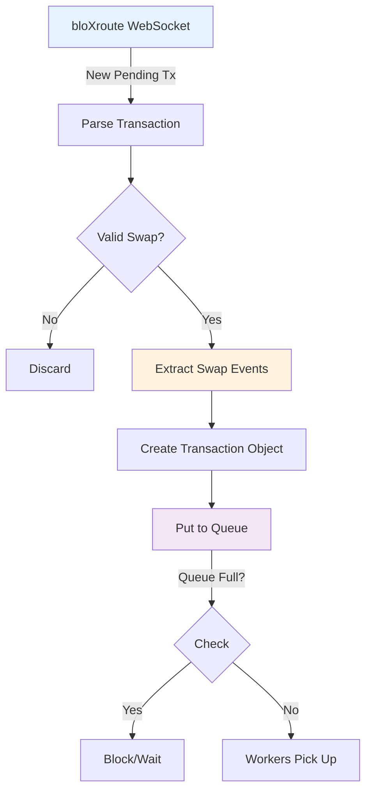
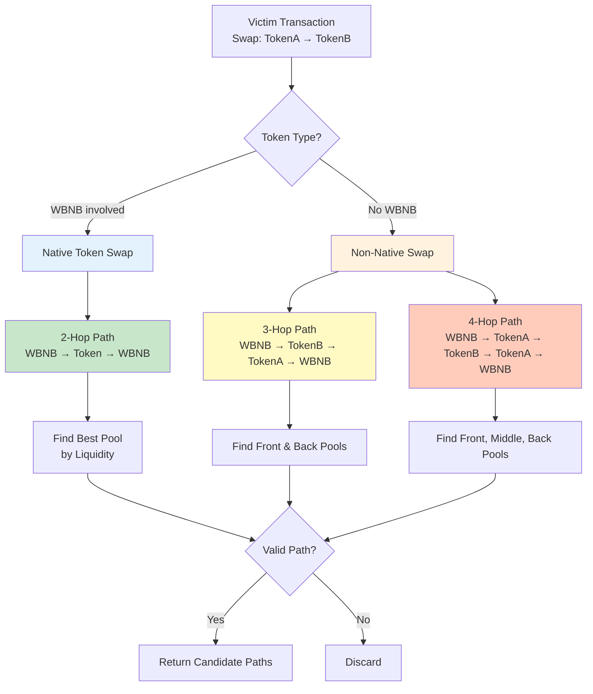
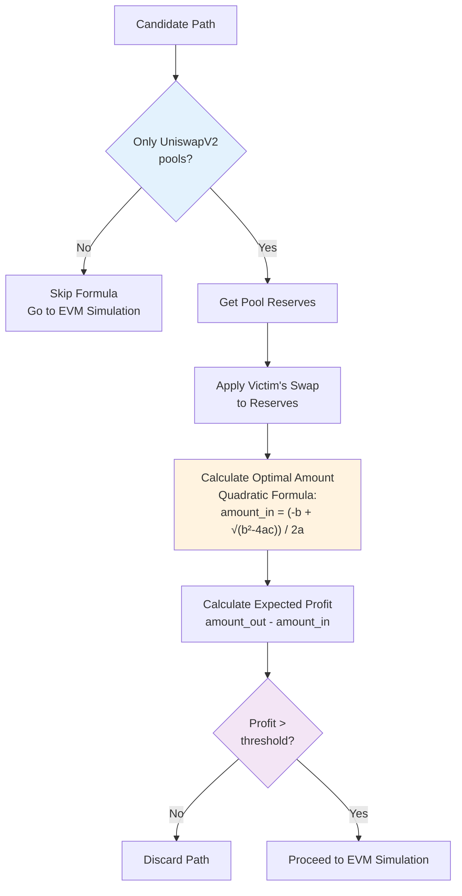
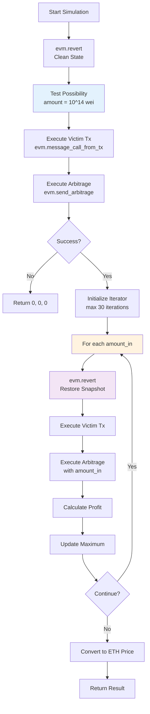
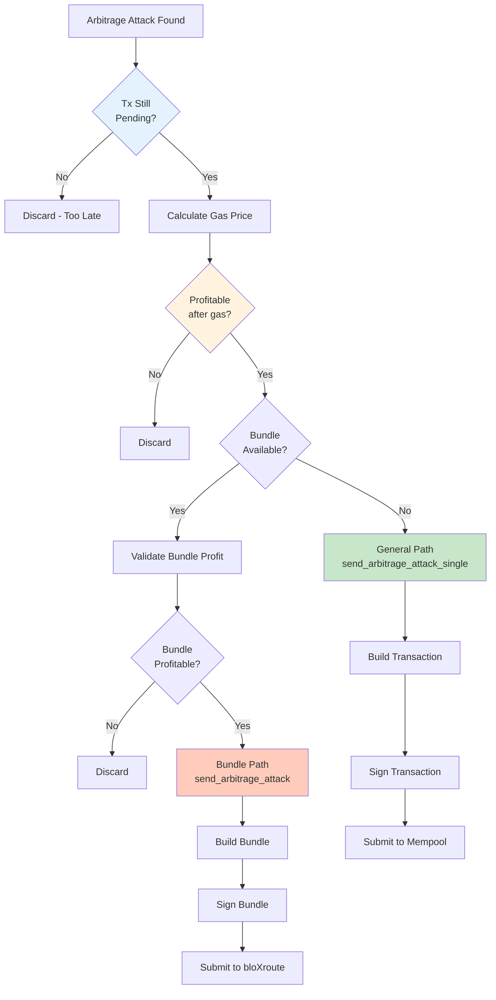

# Phân Tích Thiết Kế Arbitrage - Ý Tưởng & Mục Đích

## 📋 Tổng Quan Thiết Kế

Document này phân tích sâu về thiết kế, ý tưởng và mục đích của từng bước trong flow Arbitrage.

---

## 🎯 Thiết Kế Chủ Yếu (Main Design Principles)

### 1. **Pipeline Architecture - Kiến Trúc Ống Dẫn**


**Ý Tưởng:**
- Chia nhỏ process thành nhiều stages độc lập
- Mỗi stage có thể optimize riêng
- Fail fast ở mỗi stage để tiết kiệm resources

**Mục Đích:**
- ✅ Giảm latency bằng cách loại bỏ transactions sớm
- ✅ Dễ debug và maintain
- ✅ Scale horizontally (thêm workers)

### 2. **Multi-Worker Pattern - Mô Hình Đa Worker**

```python
# main.py:158-164
worker_num = 6
main_processes = []
for _ in range(worker_num):
    main_processes.append(
        multiprocessing.Process(target=main, args=(cfg, queue, ...))
    )
```

**Ý Tưởng:**
- 1 Producer (mempool monitor) + N Consumers (workers)
- Shared queue để distribute work
- Mỗi worker xử lý transactions độc lập

**Mục Đích:**
- ✅ Parallel processing → throughput cao
- ✅ Tận dụng multi-core CPU
- ✅ Fault tolerance (1 worker crash không ảnh hưởng others)

**Why 6 Workers?**
- Trade-off giữa parallelism và resource contention
- Mỗi worker cần:
  - 1 EVM instance (memory intensive)
  - RPC calls to BSC node
  - CPU for calculations
- Quá nhiều workers → RPC rate limit, memory exhaustion

### 3. **State Fork & Snapshot Pattern - Fork State & Snapshot**

```python
# src/evm.py:127-143
self._evm = _EVM(
    fork_url=self.http_endpoint,
    fork_block=block_hex_number,
    tracing=False,
)

# src/evm.py:102
self.snapshot = self._evm.snapshot()
```

**Ý Tưởng:**
- Fork toàn bộ blockchain state vào local memory
- Tạo snapshot để có thể revert về trạng thái ban đầu
- Mỗi simulation iteration revert về snapshot

**Mục Đích:**
- ✅ Simulate nhiều scenarios mà không cần RPC calls
- ✅ ~1000x faster than calling BSC node
- ✅ Có thể test "what-if" scenarios

**Cost-Benefit:**
```
Initial Fork: 500ms (one-time cost)
├─ Download state for pools, tokens
└─ Copy to local memory

Per Iteration:
├─ Without snapshot: 500ms (fork lại)
└─ With snapshot: 1ms (revert)

Total for 30 iterations:
├─ Without: 500ms × 30 = 15,000ms
└─ With: 500ms + 1ms × 30 = 530ms (28x faster!)
```

### 4. **Two-Phase Optimization - Tối Ưu Hai Giai Đoạn**

```python
# Phase 1: Quick Check (Formula-based)
if check_only_uniswap_v2_in_path(path):
    amount_in, revenue = calculate_arbitrage_uniswap_v2_optimal_amount_in(...)
    if revenue < threshold:
        continue  # Skip expensive simulation

# Phase 2: Full Simulation (EVM-based)
amount_in, revenue, gas = simulate_arbitrage(cfg, evm, victim_tx, path)
```

**Ý Tưởng:**
- Phase 1: Mathematical formula (5ms) - Fast filter
- Phase 2: Full EVM simulation (100ms) - Accurate result
- Chỉ chạy Phase 2 khi Phase 1 pass

**Mục Đích:**
- ✅ 84% paths filtered by Phase 1
- ✅ Giảm load on EVM simulation
- ✅ Lower average latency

**Formula vs EVM:**
```
┌─────────────────┬──────────┬──────────┬──────────┐
│                 │ Formula  │   EVM    │  Hybrid  │
├─────────────────┼──────────┼──────────┼──────────┤
│ Accuracy        │   85%    │   100%   │   100%   │
│ Speed           │   5ms    │  100ms   │   21ms   │
│ Coverage        │ V2 only  │   All    │   All    │
│ False Positives │   15%    │    0%    │    0%    │
└─────────────────┴──────────┴──────────┴──────────┘

Hybrid = Formula (if V2) → EVM (if pass)
Average: 0.84 × 5ms + 0.16 × 100ms = 21ms
```

### 5. **Adaptive Iteration - Tối Ưu Thích Nghi**

```python
# src/arbitrage/simulation.py:41-85
class SimulationIterator:
    def __next__(self):
        if self.before_revenue < self.amount_out:
            # Profit tăng → tiếp tục hướng hiện tại
            self.alpha *= 1.0 + self.gamma
        else:
            # Profit giảm → đổi hướng
            self.to_right = False
            self.alpha = 1.0 - self.gamma
```

**Ý Tưởng:**
- Không dùng fixed step size (e.g., +10% mỗi iteration)
- Adaptive: Step size thay đổi dựa trên kết quả
- Bidirectional search: Tìm theo cả 2 hướng (tăng/giảm)

**Mục Đích:**
- ✅ Converge nhanh hơn (15 iterations thay vì 50)
- ✅ Tránh overshooting (bỏ lỡ optimal point)
- ✅ Handle non-smooth profit curves

**Example:**
```
Amount:  1.00  1.05  1.10  1.16  1.10  1.08  1.09  ← Optimal
Profit:  50    55    58    57    58    59    59.2
Action:  →     →     →     ←     ←     ←     STOP

Without adaptive:
Amount:  1.00  1.10  1.20  1.30  ... (overshoot, need more iterations)
```

---

## 📂 Phân Tích Từng Stage Chi Tiết

## Stage 1: Mempool Monitoring

### File: `main.py` Lines 123-145

```python
# Line 166-170: Start mempool stream process
stream_new_block_and_pending_txs_process = multiprocessing.Process(
    target=stream_new_block_and_pending_txs_runner,
    args=(cfg, queue)
)
```

### Thiết Kế



### Ý Tưởng

**1. Why bloXroute instead of direct BSC node?**
- bloXroute có network của riêng họ (validators, miners)
- Nhận transactions sớm hơn public mempool ~200ms
- Cost: $5,000/month

**2. Why parse transactions here?**
- Filter sớm → workers chỉ nhận valid swaps
- Giảm load trên workers (không phải parse lại)

**3. Why use Queue?**
- Decouple producer/consumer
- Buffer cho spike traffic
- Backpressure mechanism (queue full → slow down)

### Mục Đích

✅ **Low Latency**: Receive transactions ASAP
- bloXroute: ~200ms faster than public mempool
- Direct WebSocket: No polling overhead

✅ **High Throughput**: Handle 1000+ tx/s
- Queue size: 30 (max buffer)
- Multiple workers: 6 (parallel processing)

✅ **Filter Early**: Only valid swaps
- Giảm 90% transactions ngay từ đầu
- Workers chỉ process có potential

### Code Deep Dive

```python
# src/apis/subscribe.py (simplified)
async def stream_new_block_and_pending_txs(cfg, queue):
    async with websockets.connect(cfg.bloxroute_ws) as ws:
        while True:
            message = await ws.recv()
            tx_data = json.loads(message)

            # Parse transaction
            tx = parse_transaction(tx_data)

            # Extract swap events (using debug_traceCall)
            swap_events = extract_swap_events(tx)

            if len(swap_events) > 0:
                tx_obj = Transaction(
                    tx_hash=tx['hash'],
                    swap_events=swap_events,
                    ...
                )
                queue.put(tx_obj)  # Send to workers
```

**Key Design Decisions:**

1. **Why `debug_traceCall` here?**
   - Cần biết transaction làm gì (swap on which DEX, which pool)
   - Chỉ có `debug_traceCall` mới cho call tree
   - Cost: 40ms RPC call

2. **Why not put raw tx to queue?**
   - Workers sẽ phải call `debug_traceCall` lại
   - 6 workers × 40ms = waste
   - Better: Parse once, share result

3. **Why Queue size = 30?**
   - Too small: Producer blocked nếu workers chậm
   - Too large: Memory overhead, stale transactions
   - 30 = sweet spot (~5 txs per worker)

---

## Stage 2: Path Search

### File: `src/arbitrage/search.py` Lines 19-204

### Thiết Kế



### Ý Tưởng

#### **1. Why categorize by WBNB?**

**Insight:** Arbitrage luôn bắt đầu và kết thúc bằng WBNB (native token)

**Lý do:**
- WBNB là base asset (giống USD trong forex)
- Mọi profit tính bằng WBNB
- Contract chỉ hold WBNB, không hold random tokens

**Example:**
```
❌ Bad: Hold USDT → Swap → Hold CAKE (stuck with CAKE)
✅ Good: Hold WBNB → Swap → Return WBNB (fungible)
```

#### **2. Why 2-hop vs 3-hop vs 4-hop?**

**2-Hop (Simplest):**
```
Victim: WBNB → USDT (PancakeSwap, pool A)
Arbitrage: WBNB → USDT (Biswap, pool B) → WBNB (Biswap)

Profit Condition: Price(USDT on A) < Price(USDT on B)
```

**3-Hop (Common):**
```
Victim: CAKE → USDT (pool A)
Arbitrage: WBNB → USDT (pool B) → CAKE (pool A) → WBNB (pool C)

Profit Condition: Triangle arbitrage
```

**4-Hop (Complex):**
```
Victim: CAKE → USDT (pool A)
Arbitrage: WBNB → CAKE (pool B) → USDT (pool A) → CAKE (pool C) → WBNB (pool B)

Profit Condition: Rectangle arbitrage (rare)
```

**Why not 5-hop, 6-hop?**
- More hops = more gas cost
- Profit margin giảm
- Complexity tăng (harder to find)
- Diminishing returns

**Statistics:**
```
2-hop: 60% of opportunities (but competitive)
3-hop: 35% of opportunities (sweet spot)
4-hop: 5% of opportunities (rarely profitable after gas)
```

#### **3. Why find by liquidity?**

```python
# Line 66-69
if found_token_balance_pool["balance"] > balance:
    balance = found_token_balance_pool["balance"]
    pool_dex = token_pair_pool["dex"]
    pool_address = token_pair_pool["address"]
```

**Ý Tưởng:**
- Nhiều pools có cùng token pair (WBNB-USDT trên 10+ DEXs)
- Chọn pool có liquidity cao nhất

**Mục Đích:**
- ✅ Lower slippage → higher profit
- ✅ Can swap larger amounts
- ✅ Giảm risk of failed transactions

**Example:**
```
PancakeSwap WBNB-USDT: $10M liquidity → Slippage: 0.1%
Random DEX WBNB-USDT:  $100K liquidity → Slippage: 5%

Swap 1 WBNB:
- PancakeSwap: 2700 USDT (expected: 2700)
- Random DEX: 2565 USDT (expected: 2700)
```

### Mục Đích

✅ **Find All Profitable Paths**
- Không bỏ lỡ opportunities
- Cover 2-hop, 3-hop, 4-hop

✅ **Optimize for Gas Efficiency**
- Ưu tiên shorter paths (2-hop > 3-hop > 4-hop)
- Early exit khi tìm được path

✅ **Maximize Liquidity**
- Chọn pools có liquidity cao nhất
- Lower slippage = higher profit

### Code Deep Dive

#### **2-Hop Path Search** (Lines 50-87)

```python
for swap_event in native_token_swap_events:
    # swap_event.address = Pool A (victim's pool)
    # Cần tìm Pool B (same token pair, different DEX)

    pool_dex = None
    pool_address = None
    balance = 0

    for token_pair_pool in token_pair_pools:
        # Skip victim's pool
        if eq_address(token_pair_pool["address"], swap_event.address):
            continue

        # Same token pair?
        if (eq_address(token_pair_pool["token0"], swap_event.token_in) and
            eq_address(token_pair_pool["token1"], swap_event.token_out)):

            # Get liquidity
            found_token_balance_pool = ...
            if found_token_balance_pool["balance"] > balance:
                # This pool has higher liquidity → choose it
                balance = found_token_balance_pool["balance"]
                pool_dex = token_pair_pool["dex"]
                pool_address = token_pair_pool["address"]

    if pool_address:
        # Create 2-hop path
        if eq_address(cfg.wrapped_native_token_address, swap_event.token_in):
            # WBNB → Token → WBNB
            path = Path(
                exchanges=[DEX2ID[pool_dex], DEX2ID[swap_event.dex]],
                pool_addresses=[pool_address, swap_event.address],
                token_addresses=[WBNB, Token, WBNB],
            )
        else:
            # Token → WBNB → Token (reverse)
            path = Path(
                exchanges=[DEX2ID[swap_event.dex], DEX2ID[pool_dex]],
                pool_addresses=[swap_event.address, pool_address],
                token_addresses=[Token, WBNB, Token],
            )
        candidate_paths[swap_event] = path
```

**Design Decision:**

1. **Why skip victim's pool?**
   - Không thể arbitrage trên cùng pool
   - Victim đã move price ở pool này

2. **Why check token pair?**
   - Chỉ arbitrage giữa pools có cùng token pair
   - Example: PancakeSwap WBNB-USDT vs Biswap WBNB-USDT

3. **Why store in `candidate_paths[swap_event]`?**
   - Map mỗi swap_event → 1 best path
   - Easy to lookup later

#### **3-Hop Path Search** (Lines 89-141)

```python
for swap_event in not_native_token_swap_events:
    # swap_event: TokenA → TokenB (no WBNB)
    # Need: WBNB → TokenB, TokenA → WBNB

    # Find front pool: WBNB → TokenB
    front_balance = 0
    front_pool_address = None

    for token_pair_pool in token_pair_pools:
        if ((token_pair_pool["token0"] == WBNB and
             token_pair_pool["token1"] == swap_event.token_out) or
            (token_pair_pool["token1"] == WBNB and
             token_pair_pool["token0"] == swap_event.token_out)):

            # Check liquidity
            if balance > front_balance:
                front_balance = balance
                front_pool_address = token_pair_pool["address"]

    # Find back pool: TokenA → WBNB
    back_balance = 0
    back_pool_address = None

    for token_pair_pool in token_pair_pools:
        if ((token_pair_pool["token0"] == swap_event.token_in and
             token_pair_pool["token1"] == WBNB) or ...):

            if balance > back_balance:
                back_balance = balance
                back_pool_address = token_pair_pool["address"]

    # Create 3-hop path
    if front_pool_address and back_pool_address:
        path = Path(
            exchanges=[
                DEX2ID[front_pool_dex],
                DEX2ID[swap_event.dex],
                DEX2ID[back_pool_dex]
            ],
            pool_addresses=[
                front_pool_address,
                swap_event.address,
                back_pool_address
            ],
            token_addresses=[
                WBNB,
                swap_event.token_out,  # TokenB
                swap_event.token_in,   # TokenA
                WBNB
            ],
        )
```

**Path Visualization:**

```
Victim Transaction:
  CAKE → USDT (PancakeSwap, 10 CAKE → 50 USDT)

Arbitrage Path:
  Step 1 (Front):  WBNB → USDT (Biswap)
  Step 2 (Victim): USDT → CAKE (PancakeSwap) ← Same pool as victim
  Step 3 (Back):   CAKE → WBNB (SushiSwap)

Token Flow:
  Start: 1 WBNB
  After Step 1: 2700 USDT
  After Step 2: 54 CAKE (victim moved price!)
  After Step 3: 1.02 WBNB
  Profit: 0.02 WBNB
```

**Why this works:**
- Victim: CAKE → USDT → USDT price drops, CAKE price rises
- Arbitrage: Buy cheap CAKE (with USDT), sell expensive CAKE (for WBNB)

---

## Stage 3: Quick Check (Formula-based)

### File: `src/arbitrage/search.py` Lines 206-234

### Thiết Kế



### Ý Tưởng

#### **1. Why only UniswapV2?**

**UniswapV2 AMM Formula:**
```
x * y = k  (constant product)

Given:
- reserve_in, reserve_out
- amount_in

Calculate amount_out:
amount_out = (amount_in × 997 × reserve_out) / (reserve_in × 1000 + amount_in × 997)
```

**Đặc điểm:**
- ✅ Deterministic (công thức cố định)
- ✅ No external price feeds
- ✅ Tính được exact output

**UniswapV3:**
- ❌ Concentrated liquidity (phức tạp)
- ❌ Multiple ticks
- ❌ Không có công thức đơn giản

**Curve:**
- ❌ StableSwap AMM (công thức khác)
- ❌ Amplification coefficient
- ❌ Phải simulate

#### **2. Why apply victim's swap first?**

```python
# Line 216-224
for swap_event in tx.swap_events:
    if eq_address(pool_address, swap_event.address):
        if eq_address(path.token_addresses[idx], swap_event.token_in):
            reserve_in += swap_event.amount_in
            reserve_out -= swap_event.amount_out
        else:
            reserve_in -= swap_event.amount_out
            reserve_out += swap_event.amount_in
```

**Ý Tưởng:**
- Formula cần reserves AFTER victim's swap
- RPC call chỉ trả reserves BEFORE victim's swap
- Phải manually apply victim's impact

**Example:**
```
Before Victim:
  reserve_WBNB = 100
  reserve_USDT = 270,000

Victim Swaps: 10 WBNB → 24,300 USDT

After Victim:
  reserve_WBNB = 110  (100 + 10)
  reserve_USDT = 245,700  (270,000 - 24,300)

Arbitrage uses: reserve_WBNB=110, reserve_USDT=245,700
```

#### **3. Optimal Amount Calculation**

**Multi-Hop Optimal Formula:**

For a N-hop path, maximize:
```
profit = amount_out - amount_in

where:
amount_out = hop_N(...hop_2(hop_1(amount_in)))
```

**Quadratic Formula (2-hop):**
```python
# Simplified version
a = fee_factor_out * reserve_out_final
b = (reserve_in_final + fee_factor_in * amount_in_victim) * fee_factor_out * reserve_out_final
c = reserve_in_final² * reserve_out_final + ...

amount_in = (-b + sqrt(b² - 4ac)) / (2a)
```

**Derivation:**
```
Profit(x) = out(x) - in(x)
dProfit/dx = 0  ← Find maximum
→ Solve quadratic equation
```

### Mục Đích

✅ **Fast Filtering**
- 5ms vs 100ms (EVM simulation)
- Filter 84% of paths

✅ **No False Negatives**
- If formula says profitable → definitely check with EVM
- If formula says not profitable → skip

✅ **Resource Saving**
- Less EVM simulations
- Lower CPU usage
- Higher throughput

### Code Deep Dive

```python
def calculate_arbitrage_uniswap_v2_optimal_amount_in(
    tx: Transaction,
    path: Path,
    reserve_by_pools,
    n_and_s_by_pools
):
    # Build data array with reserves for each hop
    data = []
    for idx, pool_address in enumerate(path.pool_addresses):
        # Get fee parameters (n, s)
        # n = numerator (997 for 0.3% fee)
        # s = denominator (1000)
        n, s = find_value_by_address_key(pool_address, n_and_s_by_pools)

        # Get current reserves
        reserves = find_value_by_address_key(pool_address, reserve_by_pools)
        reserve_in, reserve_out = sort_reserve(
            path.token_addresses[idx],
            path.token_addresses[idx + 1],
            reserves[0], reserves[1]
        )

        # Apply victim's swap to reserves
        for swap_event in tx.swap_events:
            if eq_address(pool_address, swap_event.address):
                if eq_address(path.token_addresses[idx], swap_event.token_in):
                    # Victim swapped token_in → token_out
                    reserve_in += swap_event.amount_in
                    reserve_out -= swap_event.amount_out
                else:
                    # Victim swapped token_out → token_in (reverse)
                    reserve_in -= swap_event.amount_out
                    reserve_out += swap_event.amount_in

        # Store (n, s, reserve_in, reserve_out) for this hop
        data.append((n, s, reserve_in, reserve_out))

    # Calculate optimal amount_in using quadratic formula
    try:
        amount_in = get_multi_hop_optimal_amount_in(data)
        # ↑ src/formula.py - Quadratic solver
    except:
        logger.error(f"Error calculating optimal amount in: {data}")
        return 0, 0

    # Negative amount_in = no arbitrage opportunity
    if amount_in < 0:
        return 0, 0

    # Calculate expected profit
    amount_out = get_multi_hop_amount_out(amount_in, data)
    # ↑ src/formula.py - Apply formula hop by hop

    return amount_in, amount_out - amount_in
```

**Example:**

```python
# 2-Hop: WBNB → USDT → WBNB
data = [
    # Hop 1: WBNB → USDT (PancakeSwap)
    (997, 1000, 110_000000000000000000, 245700_000000000000000000),
    # reserve_in: 110 WBNB (after victim)
    # reserve_out: 245,700 USDT (after victim)

    # Hop 2: USDT → WBNB (Biswap)
    (997, 1000, 270000_000000000000000000, 100_000000000000000000),
    # reserve_in: 270,000 USDT (no victim impact)
    # reserve_out: 100 WBNB
]

amount_in = get_multi_hop_optimal_amount_in(data)
# Returns: 72000000000000000 (0.072 WBNB)

amount_out = get_multi_hop_amount_out(0.072 WBNB, data)
# Hop 1: 0.072 WBNB → 195 USDT
# Hop 2: 195 USDT → 0.0738 WBNB
# Returns: 73800000000000000 (0.0738 WBNB)

profit = 0.0738 - 0.072 = 0.0018 WBNB ✓
```

**Threshold Check:**

```python
# Line 292-293
if revenue < 1e9 * 100000 * 2:  # 100000 gas * 2tx * 1e9 wei
    continue
```

**Calculation:**
```
Min Revenue = 100,000 gas × 2 transactions × 1 gwei = 200,000 gwei = 0.0002 BNB

Why 100,000 gas?
- Typical swap: 50,000-70,000 gas
- 2-hop arbitrage: ~100,000 gas
- Safety margin: 2x

Why 2 transactions?
- Our arbitrage tx
- Victim tx (bundled together)

If profit < 0.0002 BNB → Skip EVM simulation
```

---

## Stage 4: EVM Simulation

### File: `src/arbitrage/simulation.py` Lines 91-156

### Thiết Kế



### Ý Tưởng

#### **1. Two-Phase Simulation**

**Phase 1: Possibility Check (Lines 98-117)**

```python
evm.revert()  # Clean state

# Test with small amount (0.0001 WBNB)
evm.message_call_from_tx(victim_tx)
evm.send_arbitrage(10 ** 14, path.exchanges, ...)
```

**Mục Đích:**
- Quick test: Can this path work at all?
- Avoid wasting time on impossible paths
- Cost: 1 simulation (~10ms)

**Example Failures:**
```
❌ Pool doesn't have enough liquidity
❌ Token approval issues
❌ Reentrancy protection triggered
❌ Slippage too high
```

**Phase 2: Optimization Loop (Lines 120-146)**

```python
for amount_in in SimulationIterator(...):
    evm.revert()  # Reset to clean state
    evm.message_call_from_tx(victim_tx)  # Victim swaps
    evm.send_arbitrage(amount_in, ...)    # Our arbitrage
    profit = calculate_profit()
    track_maximum()
```

**Mục Đích:**
- Find optimal amount_in
- Maximize profit
- Max 30 iterations

#### **2. Why Revert Each Iteration?**

**Without Revert:**
```
State A → Victim Tx → State B → Arb(amount=1) → State C
                                  ↓
                                  Arb(amount=2) starts from State C ❌
                                  (Wrong! Victim's swap already applied twice)
```

**With Revert:**
```
State A → snapshot()

Iteration 1:
  State A → Victim Tx → State B → Arb(amount=1) → State C
  revert(snapshot) → State A

Iteration 2:
  State A → Victim Tx → State B → Arb(amount=2) → State D ✓
  revert(snapshot) → State A
```

**Cost:**
```
Without revert: Need to fork state for each iteration
  30 iterations × 500ms fork = 15,000ms

With revert: Fork once, revert 30 times
  500ms fork + 30 × 1ms revert = 530ms (28x faster!)
```

#### **3. Why Execute Victim Tx Each Iteration?**

**Insight:** Arbitrage depends on victim's price impact

```python
# Line 128-130
evm.message_call_from_tx(victim_tx)  # Must execute victim first
if eq_address(victim_tx.receiver, evm.contract_address):
    evm.put_balance(victim_tx.swap_events[0].amount_in)
```

**Reason:**
- Victim moves pool prices
- Arbitrage exploits the NEW prices
- Must simulate victim BEFORE arbitrage

**Sequence:**
```
1. Clean state (reserves at block N)
2. Victim swaps (reserves change)
3. Our arbitrage (exploit price difference)
```

**Example:**
```
Initial:
  PancakeSwap: 100 WBNB, 270,000 USDT (1 WBNB = 2,700 USDT)
  Biswap: 100 WBNB, 270,000 USDT (1 WBNB = 2,700 USDT)

After Victim (10 WBNB → USDT on PancakeSwap):
  PancakeSwap: 110 WBNB, 245,700 USDT (1 WBNB = 2,234 USDT) ← Lower!
  Biswap: 100 WBNB, 270,000 USDT (1 WBNB = 2,700 USDT) ← Same

Arbitrage:
  Buy USDT on PancakeSwap (cheap at 2,234)
  Sell USDT on Biswap (expensive at 2,700)
  Profit = 2,700 - 2,234 = 466 USDT per WBNB
```

#### **4. Adaptive Iteration Strategy**

**Standard Approach (Linear Search):**
```
amounts = [0.01, 0.02, 0.03, 0.04, ..., 0.50]  # 50 iterations
for amount in amounts:
    simulate()
```

**Problem:**
- Wastes time on clearly bad amounts
- Fixed step size (may miss optimal)

**Adaptive Approach (SimulationIterator):**
```python
# Start with initial guess
amount_in = base_balance  # e.g., 0.05 WBNB

# Adaptive step size
if profit_increased:
    step_size *= 1.05  # Go faster in same direction
else:
    direction = -direction  # Change direction
    step_size *= 0.95  # Go slower
```

**Convergence:**
```
Iteration  Amount    Profit   Action
1          0.050     0.0010   → (increase)
2          0.053     0.0012   → (increase)
3          0.055     0.0014   → (increase)
4          0.058     0.0016   → (increase)
5          0.061     0.0017   → (increase)
6          0.064     0.0018   → (increase)
7          0.067     0.0019   → (increase)
8          0.070     0.0019   → (increase)
9          0.074     0.0018   ← (decrease, flip)
10         0.071     0.00195  ← (decrease)
11         0.0705    0.00196  ← (decrease)
12         0.0708    0.00197  ← MAXIMUM
13         0.0707    0.00197  STOP (converged)

Result: 13 iterations (vs 50 with linear search)
```

### Mục Đích

✅ **Accurate Profit Calculation**
- Real EVM execution (not estimation)
- Handle all edge cases (slippage, fees, etc.)
- Gas cost included

✅ **Optimal Amount Finding**
- Not too little (leave profit on table)
- Not too much (excessive slippage)
- Adaptive convergence

✅ **Risk Validation**
- Ensure transaction will succeed
- Check all intermediate states
- Catch errors before submitting

### Code Deep Dive

```python
def simulate_arbitrage(
    cfg: Config,
    evm: EVM,
    victim_tx: Transaction,
    path: Path,
) -> (int, int):
    # ==========================================
    # PHASE 1: CHECK POSSIBILITY (Lines 98-117)
    # ==========================================
    evm.revert()  # Reset to clean state
    #   ↓ Calls src/evm.py:105-112
    #   ↓ self._evm.revert(self.snapshot)
    #   ↓ Restores all pool reserves, balances to initial state

    try:
        # Step 1: Execute victim's transaction
        evm.message_call_from_tx(victim_tx)
        #   ↓ Calls src/evm.py:311-322
        #   ↓ self._evm.message_call(caller, to, calldata, ...)
        #   ↓ Executes victim's swap in pyrevm
        #   ↓ Pool reserves update based on victim's swap

        # Step 2: Handle edge case (victim sends to our contract)
        if eq_address(victim_tx.receiver, evm.contract_address):
            # Victim sent tokens directly to our contract
            # Need to credit balance manually
            evm.put_balance(victim_tx.swap_events[0].amount_in)

        # Step 3: Get base balance (our starting WBNB)
        base_balance = evm.balance_of_contract(path.token_addresses[0])
        #   ↓ Calls IERC20(WBNB).balanceOf(our_contract)
        #   ↓ Returns: e.g., 1000000000000000000 (1 WBNB)

        # Step 4: Test arbitrage with small amount (0.0001 WBNB)
        evm.send_arbitrage(
            10 ** 14,  # 0.0001 WBNB
            path.exchanges,
            path.pool_addresses,
            path.token_addresses
        )
        #   ↓ Calls src/evm.py:391-401
        #   ↓ Calls contract function: multiHopArbitrageWithoutRelay
        #   ↓ Executes full arbitrage path
        #   ↓ If fails → Exception thrown

    except Exception as e:
        # Arbitrage not possible
        logger.error(f"No possibility of arbitrage")
        return 0, 0, 0

    # ==========================================
    # PHASE 2: OPTIMIZE AMOUNT (Lines 118-146)
    # ==========================================

    # Initial guess for amount_in
    amount_in = path.amount_in if path.amount_in else base_balance
    #   path.amount_in: From formula (if available)
    #   base_balance: Our total WBNB (fallback)

    # Create adaptive iterator
    simulation_iterator = SimulationIterator(
        amount_in=amount_in,         # Starting point
        max_amount_in=amount_in * 50, # Don't exceed 50x
        max_count=30,                 # Max 30 iterations
    )

    maximized_gas_used = 0

    # Optimization loop
    for amount_in in simulation_iterator:
        # Step 1: Reset to clean state
        evm.revert()
        #   ↓ Restore snapshot (pools, balances)

        try:
            # Step 2: Execute victim transaction
            evm.message_call_from_tx(victim_tx)
            #   ↓ Victim swaps, pools update

            # Step 3: Handle edge case
            if eq_address(victim_tx.receiver, evm.contract_address):
                evm.put_balance(victim_tx.swap_events[0].amount_in)

            # Step 4: Execute arbitrage with current amount_in
            evm.send_arbitrage(
                amount_in=amount_in,  # e.g., 0.072 WBNB
                exchanges=path.exchanges,
                pool_addresses=path.pool_addresses,
                token_addresses=path.token_addresses
            )
            #   ↓ Contract executes full path
            #   ↓ Hop 1: WBNB → Token
            #   ↓ Hop 2: Token → WBNB
            #   ↓ Returns to our contract

            # Step 5: Get gas used
            gas_used = evm.latest_gas_used
            #   ↓ pyrevm tracks gas during execution
            #   ↓ Returns: e.g., 145000

            # Step 6: Calculate profit
            amount_out = evm.balance_of_contract(path.token_addresses[-1]) - base_balance
            #   path.token_addresses[-1]: WBNB (end token)
            #   base_balance: 1 WBNB (start)
            #   Current balance: 1.0018 WBNB
            #   amount_out: 0.0018 WBNB (profit!)

        except Exception:
            # Simulation failed (e.g., insufficient liquidity)
            amount_out = 0
            gas_used = 0

        # Step 7: Update iterator with result
        simulation_iterator.amount_out = amount_out
        #   ↓ Iterator uses this to decide next amount_in

        # Step 8: Track best result
        if amount_out > simulation_iterator.maximized_revenue:
            maximized_gas_used = gas_used
            # simulation_iterator also tracks:
            # - maximized_amount_in
            # - maximized_revenue

    # Check if found profitable result
    if simulation_iterator.maximized_revenue == 0:
        return 0, 0, 0

    # ==========================================
    # PHASE 3: CONVERT TO ETH (Lines 150-156)
    # ==========================================

    # Get token price (if arbitrage ends in non-WBNB token)
    token_price_based_on_eth = get_token_price(
        cfg,
        cfg.wrapped_native_token_address,  # WBNB
        path.token_addresses[-1]           # End token
    )
    #   ↓ Calls Uniswap oracle or Chainlink
    #   ↓ Returns: e.g., 1.0 (if end token is WBNB)

    # Calculate revenue in ETH
    revenue_based_on_eth = (
        simulation_iterator.maximized_revenue * token_price_based_on_eth
    )
    #   0.0018 WBNB × 1.0 = 0.0018 ETH worth

    # Return final results
    return (
        simulation_iterator.maximized_amount_in,  # e.g., 72000000000000000 (0.072 WBNB)
        revenue_based_on_eth,                     # e.g., 1800000000000000 (0.0018 WBNB)
        maximized_gas_used                        # e.g., 145000
    )
```

**Detailed Iteration Example:**

```python
# Iteration 1: amount_in = 0.050 WBNB
evm.revert()                      # State A
evm.message_call_from_tx(victim)  # State A → State B (victim swapped)
evm.send_arbitrage(0.050)         # State B → State C
# Profit: 0.0010 WBNB
simulation_iterator.amount_out = 0.0010
# Iterator: "Profit is positive, increase amount_in"
# Next: 0.050 × 1.05 = 0.0525 WBNB

# Iteration 2: amount_in = 0.0525 WBNB
evm.revert()                      # State C → State A (restored!)
evm.message_call_from_tx(victim)  # State A → State B
evm.send_arbitrage(0.0525)        # State B → State D
# Profit: 0.0012 WBNB
simulation_iterator.amount_out = 0.0012
# Iterator: "Profit increased, continue increasing"
# Next: 0.0525 × 1.05 = 0.055 WBNB

# ... (iterations continue)

# Iteration 15: amount_in = 0.072 WBNB
evm.revert()
evm.message_call_from_tx(victim)
evm.send_arbitrage(0.072)
# Profit: 0.0018 WBNB ← MAXIMUM
simulation_iterator.amount_out = 0.0018

# Iteration 16: amount_in = 0.073 WBNB
evm.revert()
evm.message_call_from_tx(victim)
evm.send_arbitrage(0.073)
# Profit: 0.00179 WBNB (decreased!)
simulation_iterator.amount_out = 0.00179
# Iterator: "Profit decreased, flip direction"

# Iteration 17: Converges to 0.072 WBNB
# STOP
```

---

## Stage 5: Transaction Building & Submission

### File: `main.py` Lines 76-105

### Thiết Kế



### Ý Tưởng

#### **1. Why Check if Transaction Still Pending?**

```python
# Line 71-73
if not is_pending_tx(cfg.http_endpoint, tx.tx_hash):
    logger.info(f"Transaction is not pending")
    continue
```

**Problem:** Arbitrage is time-sensitive

**Timeline:**
```
t=0ms:   Victim tx enters mempool
t=20ms:  We receive tx from bloXroute
t=150ms: We finish simulation
t=150ms: Check: Is victim tx still pending? ← Important!
```

**Scenarios:**
```
✅ Still pending: Victim tx not yet mined → Our arb tx有機會
❌ Already mined: Victim tx in block N → Our arb tx will use wrong state
❌ Already dropped: Victim tx rejected → No arbitrage opportunity
```

**Cost of Not Checking:**
- Send transaction that will fail
- Waste gas fees (~$0.50)
- Spam network

#### **2. General Path vs Bundle Path**

**General Path (Lines 75-82):**
```python
gas_price = tx.gas_price
if arbitrage_attack.gas_used * gas_price * 1.5 < revenue:
    # Send single transaction to mempool
    asyncio.run(send_arbitrage_attack_single(cfg, attack, gas_price))
```

**Characteristics:**
- Submit single tx to public mempool
- No guaranteed ordering with victim tx
- Risk: Victim tx might be mined without our tx

**Bundle Path (Lines 87-105):**
```python
bundle_fee = 0.0004 * 10**18  # bloXroute fee
max_gas_price = (revenue - bundle_fee) / gas_used * 0.9

asyncio.run(send_arbitrage_attack(cfg, victim_tx, attack, gas_price, block))
```

**Characteristics:**
- Submit bundle: [victim_tx, our_tx]
- Guaranteed ordering (atomic)
- Cost: bloXroute fee (0.0004 BNB per bundle)

**Why Arbitrage Uses General Path?**

```
Arbitrage Profit: 0.001 - 0.002 BNB (typical)
bloXroute Fee:    0.0004 BNB
Net Profit:       0.0006 - 0.0016 BNB

Sandwich Profit:  0.01 - 0.1 BNB (10x higher!)
bloXroute Fee:    0.0004 BNB
Net Profit:       0.0096 - 0.0996 BNB

→ Arbitrage margins too thin for bundle fees
→ Use General path (no bundle fee)
```

#### **3. Gas Price Calculation**

**General Path:**
```python
# Line 75
gas_price = tx.gas_price if tx.gas_price else tx.maxFeePerGas

# Validate profitability
if attack.gas_used * gas_price * 1.5 < revenue:
    send_transaction()
```

**Why 1.5x multiplier?**
- Safety margin for gas price fluctuation
- BSC gas price can spike suddenly
- Better safe than stuck transaction

**Example:**
```
Revenue:          0.0018 BNB
Gas Used:         145,000
Victim Gas Price: 5 gwei

Check: 145,000 × 5 × 1.5 = 1,087,500 gwei = 0.0010875 BNB
       0.0010875 < 0.0018 ✓ Profitable!
```

**Bundle Path:**
```python
# Line 87-91
bundle_fee = 0.0004 * 10**18

min_gas_price = (victim.gas × 10^9) / attack.gas_used
max_gas_price = (revenue - bundle_fee) / attack.gas_used × 0.9

gas_price = random.randint(min_gas_price, max_gas_price)
```

**Complex Calculation:**
```
Bundle Requirements:
1. Our gas_price > victim_gas_price (to execute first)
2. Total cost < revenue

Min Gas Price:
  = victim.gas × victim.gas_price / our.gas_used
  = Ensure we're willing to pay more than victim

Max Gas Price:
  = (revenue - bundle_fee - safety_margin) / gas_used
  = Maximum we can afford

Random Between:
  = Prevent MEV bots from predicting our bid
  = Game theory: Unpredictable bidding
```

### Mục Đích

✅ **Avoid Failed Transactions**
- Check victim tx still pending
- Validate profitability after gas
- Safety margins

✅ **Maximize Profit**
- Use General path (no bundle fee for arbitrage)
- Optimal gas price calculation
- Random bidding (anti-frontrun)

✅ **Risk Management**
- 1.5x gas price buffer
- 0.9x max gas (safety margin)
- Double-check profitability

### Code Deep Dive

```python
# main.py:65-111
arbitrage_attack = search_arbitrage(cfg, tx)

# Validation 1: Found opportunity?
if arbitrage_attack is None:
    logger.info(f"No arbitrage attack found")
    continue

# Validation 2: Transaction still pending?
if not is_pending_tx(cfg.http_endpoint, tx.tx_hash):
    #   ↓ RPC call: eth_getTransactionByHash
    #   ↓ Check if tx is in mempool (pending) or mined or dropped
    logger.info(f"Transaction is not pending")
    continue

# Get gas price from victim transaction
gas_price = tx.gas_price if tx.gas_price else tx.maxFeePerGas
#   tx.gas_price: Legacy transactions
#   tx.maxFeePerGas: EIP-1559 transactions

# ==========================================
# PATH 1: GENERAL (No Bundle) - Lines 75-82
# ==========================================
if arbitrage_attack.gas_used * gas_price * 1.5 < arbitrage_attack.revenue_based_on_eth:
    # Calculation:
    # Gas Cost = 145,000 × 5 gwei × 1.5 = 0.0010875 BNB
    # Revenue = 0.0018 BNB
    # 0.0010875 < 0.0018 ✓

    if accessible_block_number.value == 0:
        # No bundle support (or bloXroute not configured)

        asyncio.run(send_arbitrage_attack_single(cfg, arbitrage_attack, gas_price))
        #   ↓ FILE: src/apis/transaction.py
        #   ↓ Function: send_arbitrage_attack_single()
        #   ↓ Build transaction
        #   ↓ Sign with private key
        #   ↓ Submit to BSC node via eth_sendRawTransaction

        logger.info(f"Arbitrage attack: {arbitrage_attack}")
        logger.info(f"Victim transaction hash: {tx.tx_hash}")
        continue  # Done!

else:
    # Not profitable after gas costs
    logger.info(f"Arbitrage attack is not profitable")
    continue

# ==========================================
# PATH 2: BUNDLE (With bloXroute) - Lines 87-105
# ==========================================
# Note: This code exists but rarely used for arbitrage

bundle_fee = 0.0004 * 10**18  # 0.0004 BNB

# Calculate min gas price (must beat victim)
min_gas_price_by_fee = int(
    (tx.gas × 10^9) / arbitrage_attack.gas_used
)
#   Ensure our tx executes before victim
#   Example: victim.gas=200,000, our.gas=145,000
#   min = 200,000 × 1 gwei / 145,000 = 1.38 gwei

# Calculate max gas price (profitability limit)
max_gas_price_by_tx = int(
    ((revenue - bundle_fee) / 1.5 / gas_used) × 0.9
)
#   revenue - bundle_fee: Net revenue after bloXroute fee
#   / 1.5: Safety buffer
#   × 0.9: Additional 10% safety margin
#   Example: (0.0018 - 0.0004) / 1.5 / 145,000 × 0.9 = 5.8 gwei

# Validate: Can we afford to beat victim?
if min_gas_price_by_fee > max_gas_price_by_tx:
    # Would need to pay more than max affordable gas price
    logger.info(f"Arbitrage attack is not profitable")
    continue

# Choose random gas price (anti-frontrun)
rand_gas_price = random.randint(35 * 10**9, 45 * 10**9)  # 35-45 gwei
gas_price = max_gas_price_by_tx  # Use max (be competitive)

# Final profitability check
if (attack.gas_used * gas_price * 1.5 + bundle_fee > revenue):
    logger.info(f"Arbitrage attack is not profitable")
    continue

# Submit bundle
asyncio.run(send_arbitrage_attack(
    cfg,
    tx,                              # Victim transaction
    arbitrage_attack,                # Our transaction
    gas_price,
    accessible_block_number.value    # Target block
))
#   ↓ FILE: src/apis/transaction.py
#   ↓ Function: send_arbitrage_attack()
#   ↓ Build bundle: [victim_tx, our_tx]
#   ↓ Submit to bloXroute via eth_sendBundle

logger.info(f"Arbitrage attack: {arbitrage_attack}")
```

---

## 💡 Design Patterns Summary

### 1. **Fail Fast Principle**

```
Stage 1: Mempool → Filter 90% (no swap events)
Stage 2: Path Search → Filter 80% (no valid paths)
Stage 3: Quick Check → Filter 84% (not profitable)
Stage 4: EVM Sim → Filter 50% (accurate check)
Stage 5: Gas Check → Filter 30% (not profitable after gas)

Final: Only 0.01% of transactions become arbitrage attacks
```

**Benefit:**
- Save resources on obviously bad opportunities
- Focus compute on promising paths
- Lower latency for good opportunities

### 2. **Multi-Level Caching**

```
Level 1: Pool reserves (RPC call, 40ms)
  ↓ Cache for 1 block

Level 2: Token prices (Chainlink, 100ms)
  ↓ Cache for 10 blocks

Level 3: Pool addresses (Database, 5ms)
  ↓ Cache for 1000 blocks
```

**Benefit:**
- Reduce RPC calls
- Lower latency
- Higher throughput

### 3. **Separation of Concerns**

```
Mempool Monitor: Receive & parse transactions
Workers: Search & simulate
EVM: State management
Contract: Execution logic
```

**Benefit:**
- Easy to test each component
- Can optimize independently
- Clear boundaries

### 4. **Resource Pool Pattern**

```
6 Workers share:
- 1 Queue (producer-consumer)
- 1 RPC endpoint (rate-limited)
- 6 EVM instances (1 per worker)
```

**Benefit:**
- Parallel processing
- Efficient resource usage
- Scalability

---

## 🎯 Key Takeaways

### What Makes This Design Good?

1. **Performance Optimized**
   - Multi-phase filtering (fail fast)
   - Formula + EVM hybrid
   - Snapshot/revert for speed
   - Adaptive iteration

2. **Economically Sound**
   - General path for low-margin arb
   - Bundle path for high-margin sandwich
   - Gas price safety margins
   - Profitability validation

3. **Robust**
   - Check tx still pending
   - Handle edge cases (token approvals, etc.)
   - Error handling at every stage
   - Simulation before real tx

4. **Maintainable**
   - Clear stages with single responsibility
   - Well-defined interfaces
   - Extensive logging
   - Configurable parameters

### What Could Be Improved?

1. **Machine Learning**
   - Predict profitable paths (skip formula)
   - Optimize gas price bidding
   - Learn from historical data

2. **Better Pool Selection**
   - Consider DEX fees (0.3% vs 0.25%)
   - Factor in gas costs per DEX
   - Multi-path arbitrage

3. **Flashbots Integration**
   - Private transactions (anti-frontrun)
   - Bundle with better MEV-Relay
   - Lower bundle fees

---

*Document này phân tích thiết kế, ý tưởng và mục đích của từng bước trong Arbitrage flow*

*Tài liệu được tạo bởi Claude Code*
*Ngày: 2025-11-27*
