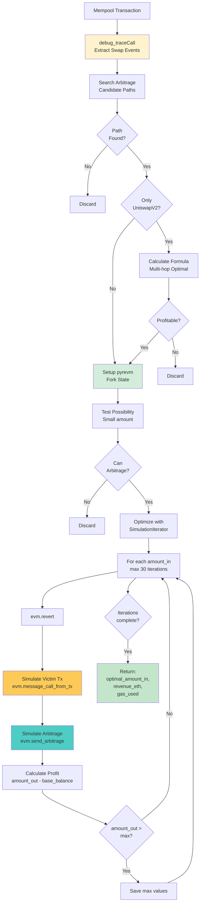

# Arbitrage có dùng pyrevm không?

## ✅ CÓ - Arbitrage Trading CÓ SỬ DỤNG pyrevm!

Tuy nhiên, cách sử dụng khác với Sandwich attack. Tài liệu này sẽ làm rõ sự khác biệt.

## 🔄 Complete Arbitrage Flow



## 📊 Arbitrage vs Sandwich - Sử Dụng pyrevm

### So Sánh Cơ Bản

| Feature | Sandwich | Arbitrage |
|---------|----------|-----------|
| **Dùng pyrevm?** | ✅ CÓ | ✅ CÓ |
| **Số transactions** | 2 (FrontRun + BackRun) | 1 (Arbitrage only) |
| **Iterations** | 10-100 | max 30 |
| **Complexity** | Cao (3 simulations/iter) | Thấp (2 simulations/iter) |
| **Bundle support** | ✅ bloXroute, 48Club | ❌ General only |
| **Quick path** | ✅ UniswapV2 formula | ✅ Multi-hop formula |
| **Price impact** | ✅ Check critical | ⚠️ Less critical |

### Detailed Comparison

```mermaid
graph TB
    subgraph "Sandwich - Complex"
        S1[Setup pyrevm] --> S2[Loop: 10-100 iterations]
        S2 --> S3[Revert]
        S3 --> S4[Simulate FrontRun]
        S4 --> S5[Check Price Impact]
        S5 --> S6[Simulate Victim]
        S6 --> S7[Simulate BackRun]
        S7 --> S8[Calculate Profit]
        S8 --> S9{Max?}
        S9 -->|Yes| S10[Save]
        S9 -->|No| S2
        S10 --> S2
    end

    subgraph "Arbitrage - Simpler"
        A1[Setup pyrevm] --> A2[Loop: max 30 iterations]
        A2 --> A3[Revert]
        A3 --> A4[Simulate Victim]
        A4 --> A5[Simulate Arbitrage]
        A5 --> A6[Calculate Profit]
        A6 --> A7{Max?}
        A7 -->|Yes| A8[Save]
        A7 -->|No| A2
        A8 --> A2
    end

    style S4 fill:#ff6b6b
    style S5 fill:#4ecdc4
    style S6 fill:#feca57
    style S7 fill:#ff6b6b
    style A4 fill:#feca57
    style A5 fill:#4ecdc4
```



## 🔍 Code Analysis - Arbitrage với pyrevm

### 1. Setup pyrevm

**File**: `src/arbitrage/search.py:265-271`

```python
def search_arbitrage(cfg: Config, victim_tx: Transaction,
                    block_number="latest", evm=None):

    # Initialize pyrevm if not provided
    if evm is None:
        evm = EVM(
            http_endpoint=cfg.http_endpoint,
            account_address=cfg.account_address,
            contract_address=cfg.contract_address,
        )
        evm.set(block_number)  # Fork state at block

    block_number = evm.block_number

    # ... search paths ...

    # Simulate with pyrevm
    amount_in, revenue, gas_used = simulate_arbitrage(cfg, evm, victim_tx, path)
```

### 2. Quick Check (Formula-based)

**File**: `src/arbitrage/search.py:287-293`

```python
for event, path in candidate_paths.items():
    if check_only_uniswap_v2_in_path(path):
        # Quick calculation with multi-hop formula
        amount_in, revenue = calculate_arbitrage_uniswap_v2_optimal_amount_in(
            victim_tx, path, reserve_by_pools, n_and_s_by_pools
        )

        # Filter if not profitable
        if revenue < 1e9 * 100000 * 2:  # 200K gas threshold
            continue

    # Then verify with pyrevm simulation
    amount_in, revenue, gas_used = simulate_arbitrage(cfg, evm, victim_tx, path)
```

**Multi-hop Formula** (`src/formula.py`):
```python
def get_multi_hop_optimal_amount_in(data: List[Tuple[int, int, int, int]]):
    """
    Find optimal amount_in for multi-hop arbitrage

    data: List of (N, S, reserve_in, reserve_out) for each pool
    Returns: optimal amount_in

    Formula: Quadratic equation solution
    x* = (-b + √(b² - 4ac)) / (2a)
    """
    # ... complex math ...
```

### 3. pyrevm Simulation

**File**: `src/arbitrage/simulation.py:91-156`

```python
def simulate_arbitrage(cfg: Config, evm: EVM,
                      victim_tx: Transaction, path: Path):

    # Step 1: Test possibility (quick check)
    evm.revert()
    try:
        # Simulate victim transaction
        evm.message_call_from_tx(victim_tx)

        # Get base balance
        base_balance = evm.balance_of_contract(path.token_addresses[0])

        # Test with small amount (0.0001 ETH)
        evm.send_arbitrage(
            10**14, path.exchanges,
            path.pool_addresses, path.token_addresses
        )
    except Exception as e:
        # Not possible to arbitrage
        return 0, 0, 0

    # Step 2: Optimize amount_in
    amount_in = path.amount_in if path.amount_in else base_balance

    simulation_iterator = SimulationIterator(
        amount_in=amount_in,
        max_amount_in=amount_in * 50,  # Max 50x of initial
        max_count=30,  # Max 30 iterations (vs 100 for sandwich)
    )

    maximized_gas_used = 0

    # Step 3: Iterate to find optimal
    for amount_in in simulation_iterator:
        evm.revert()  # Clean state

        try:
            # Simulate victim transaction
            evm.message_call_from_tx(victim_tx)

            if eq_address(victim_tx.receiver, evm.contract_address):
                evm.put_balance(victim_tx.swap_events[0].amount_in)

            # Simulate arbitrage transaction
            evm.send_arbitrage(
                amount_in=amount_in,
                exchanges=path.exchanges,
                pool_addresses=path.pool_addresses,
                token_addresses=path.token_addresses
            )

            # Get results
            gas_used = evm.latest_gas_used
            amount_out = evm.balance_of_contract(path.token_addresses[-1]) - base_balance

        except Exception:
            amount_out = 0
            gas_used = 0

        # Update iterator
        simulation_iterator.amount_out = amount_out

        # Save if better
        if amount_out > simulation_iterator.maximized_revenue:
            maximized_gas_used = gas_used

    # Step 4: Convert to ETH value
    if simulation_iterator.maximized_revenue == 0:
        return 0, 0, 0

    token_price_based_on_eth = get_token_price(
        cfg, cfg.wrapped_native_token_address, path.token_addresses[-1]
    )
    revenue_based_on_eth = simulation_iterator.maximized_revenue * token_price_based_on_eth

    return (
        simulation_iterator.maximized_amount_in,
        revenue_based_on_eth,
        maximized_gas_used
    )
```

### 4. Smart Contract Call

**File**: `src/evm.py:391-401`

```python
@update_commit_count_decorator
def send_arbitrage(self, amount_in, exchanges, pool_addresses, token_addresses):
    """Simulate arbitrage transaction with pyrevm"""
    function_name = "multiHopArbitrageWithoutRelay"

    result = self.call_function(
        caller=self.account_address,
        to=self.contract_address,
        value=0,
        function_name=function_name,
        input=[0, amount_in, exchanges, pool_addresses, token_addresses],
        abi=contract_abi,
    )
    return result
```

## 📈 Arbitrage Path Examples

### 2-Hop Arbitrage
```
WBNB → (Pool A) → USDT → (Pool B) → WBNB
```

**Scenario**: Victim swaps WBNB → USDT in Pool B, tạo price difference
```python
Path(
    exchanges=[0, 0],  # Both PancakeSwapV2
    pool_addresses=["0xPoolA", "0xPoolB"],
    token_addresses=["0xWBNB", "0xUSDT", "0xWBNB"]
)
```

**Simulation**:
```
1. Victim: WBNB → USDT (Pool B)
   → Pool B now has MORE WBNB, LESS USDT
   → Price: WBNB cheaper in Pool B

2. Arbitrage: WBNB → USDT (Pool A) → WBNB (Pool B)
   → Buy USDT cheap in Pool A
   → Sell USDT expensive in Pool B
   → Get more WBNB back
```

### 3-Hop Arbitrage
```
WBNB → TokenA → TokenB → WBNB
```

**Example path**:
```python
Path(
    exchanges=[0, 0, 0],  # All PancakeSwapV2
    pool_addresses=["0xPool1", "0xPool2", "0xPool3"],
    token_addresses=["0xWBNB", "0xTokenA", "0xTokenB", "0xWBNB"]
)
```

### 4-Hop Arbitrage
```
WBNB → TokenA → TokenB → TokenC → WBNB
```

## 🎯 Why Arbitrage Uses pyrevm

### 1. Multi-Pool Complexity

**Problem**: Phải simulate qua nhiều pools
```
Pool A: WBNB → Token A (reserve changes)
Pool B: Token A → Token B (depends on Pool A output)
Pool C: Token B → WBNB (depends on Pool B output)
```

**Solution**: pyrevm simulates chính xác state changes
```python
evm.send_arbitrage(amount_in, exchanges, pools, tokens)
# pyrevm executes:
# 1. Swap in Pool A → update reserves
# 2. Swap in Pool B → update reserves (with new state)
# 3. Swap in Pool C → update reserves (with new state)
# Result: Exact final balance
```

### 2. Gas Estimation

**Arbitrage gas varies by hop count**:
```
2-hop: ~150K gas
3-hop: ~220K gas
4-hop: ~290K gas
```

**pyrevm provides exact gas**:
```python
evm.send_arbitrage(...)
gas_used = evm.latest_gas_used  # Exact gas for this path
```

### 3. Profit Verification

**Need to verify profit after gas**:
```python
revenue_before_gas = amount_out - amount_in
gas_cost = gas_used * gas_price
net_profit = revenue_before_gas - gas_cost

# Only submit if net_profit > 0
```

### 4. Edge Cases

**Handle complex scenarios**:
- Token with transfer fees
- Pool với unusual AMM curves (Curve, Balancer)
- Slippage protection
- Insufficient liquidity

**pyrevm handles all cases**:
```python
try:
    evm.send_arbitrage(...)
    profit = evm.balance_of_contract(...) - base_balance
except:
    # Transaction would fail, skip
    profit = 0
```

## 🔄 Complete Example - 2-Hop Arbitrage

### Scenario
```
Victim swaps: 100 WBNB → USDT in Pool B

Current prices:
- Pool A: 1 WBNB = 600 USDT
- Pool B: 1 WBNB = 595 USDT (before victim)

After victim swap (100 WBNB):
- Pool B: 1 WBNB = 590 USDT (cheaper!)

Arbitrage opportunity:
WBNB → (Pool A at 600) → USDT → (Pool B at 590) → WBNB
```

### Step-by-Step Simulation

#### 1. Quick Check (Formula)
```python
# Multi-hop formula
data = [
    (1000, 3, reserve_in_A, reserve_out_A),  # Pool A
    (1000, 3, reserve_in_B, reserve_out_B),  # Pool B
]
optimal_amount = get_multi_hop_optimal_amount_in(data)
# Result: ~50 WBNB optimal

expected_revenue = get_multi_hop_amount_out(optimal_amount, data) - optimal_amount
# Result: ~0.5 WBNB profit

if expected_revenue < threshold:
    skip  # Not worth simulating
```

#### 2. pyrevm Setup
```python
evm = EVM(http_endpoint, account, contract)
evm.set("pending")  # Fork at pending block

base_balance = evm.balance_of_contract(WBNB)  # e.g. 100 WBNB
```

#### 3. Test Possibility
```python
evm.revert()

# Simulate victim
evm.message_call_from_tx(victim_tx)
# Pool B state changed

# Test small arbitrage
evm.send_arbitrage(0.0001, exchanges, pools, tokens)
# Success → Opportunity exists!
```

#### 4. Optimize
```python
Iteration 1: amount_in = 50 WBNB
├─ Revert to clean state
├─ Simulate victim: 100 WBNB → USDT (Pool B)
├─ Simulate arbitrage:
│  ├─ Swap 50 WBNB → 30,000 USDT (Pool A)
│  └─ Swap 30,000 USDT → 50.5 WBNB (Pool B)
├─ Profit: 0.5 WBNB
└─ Gas: 150K

Iteration 2: amount_in = 52.5 WBNB (α = 1.05)
├─ Profit: 0.52 WBNB ↑
└─ Gas: 150K

Iteration 3-10: Continue...

Final: optimal = 55 WBNB, profit = 0.53 WBNB
```

#### 5. Results
```python
return (
    optimal_amount_in=55 WBNB,
    revenue_based_on_eth=0.53 WBNB,
    gas_used=150000
)

# Net profit check
gas_cost = 150000 × 1 Gwei = 0.00015 BNB
net_profit = 0.53 - 0.00015 = 0.52985 BNB ✅
```

## ⚠️ Why Arbitrage Only Uses General Path

**From README**:
> Why is Arbitrage Only Used for General Path?

### Reason 1: Competition with Sandwich
```
Same victim transaction:
├─ Sandwich profit: ~0.02 BNB
└─ Arbitrage profit: ~0.005 BNB

In bundle auction:
→ Sandwich bids higher
→ Sandwich wins
→ Arbitrage loses
```

### Reason 2: Bundle Fees
```
bloXroute bundle fee: ~0.002-0.005 BNB
Arbitrage profit:     ~0.005-0.01 BNB

After fee:
→ Net profit too small
→ Not worth it
```

### Reason 3: Risk vs Reward
```
General Path:
✓ Free to submit
✓ Can try many opportunities
✗ May fail (no order guarantee)
✗ Gas cost even if fail

Bundle Path:
✓ Order guaranteed
✓ No gas if fail
✗ Must bid high
✗ Competition fierce
```

### Trade-off
```python
# From main.py:76-85
if arbitrage_attack.gas_used * gas_price * 1.5 < arbitrage_attack.revenue_based_on_eth:
    if accessible_block_number.value == 0:  # General path
        # Only submit if profit > 1.5x gas cost
        asyncio.run(send_arbitrage_attack_single(...))
    else:
        # Skip - Would lose to sandwich in bundle auction
        logger.info("Arbitrage not profitable")
```

## 📊 Performance Metrics

### Timing Comparison

```
Sandwich Simulation:
├─ Quick check (V2):     5ms
├─ Setup pyrevm:         5ms
└─ Optimization:         100ms (10 iterations × 10ms)
    Total:               110ms

Arbitrage Simulation:
├─ Quick check (formula): 10ms (multi-hop complex)
├─ Setup pyrevm:          5ms
└─ Optimization:          60ms (30 max × 2ms)
    Total:                75ms

Arbitrage is faster!
```

### Why Arbitrage Faster?

1. **Fewer simulations per iteration**
   - Sandwich: FrontRun + Victim + BackRun = 3 simulations
   - Arbitrage: Victim + Arbitrage = 2 simulations

2. **Max iterations lower**
   - Sandwich: max 100 iterations
   - Arbitrage: max 30 iterations

3. **Simpler logic**
   - No price impact checks
   - No front/back run coordination
   - Single transaction

## 🎓 Key Differences Summary

### Sandwich
```python
# Complex multi-transaction attack
evm.call_sandwich_front_run(...)   # Simulate attack tx 1
evm.message_call_from_tx(victim)   # Simulate victim
evm.call_sandwich_back_run(...)    # Simulate attack tx 2

# Check price impact
if pool_balance_after / pool_balance_before < max_rate:
    reject

# 3 transactions, many checks
```

### Arbitrage
```python
# Simple single-transaction profit
evm.message_call_from_tx(victim)   # Simulate victim
evm.send_arbitrage(...)            # Simulate arbitrage

# Calculate profit
profit = final_balance - initial_balance

# 2 simulations, simpler
```

## 📚 Code References

| Component | File | Lines |
|-----------|------|-------|
| Search | `src/arbitrage/search.py` | 260-319 |
| Simulation | `src/arbitrage/simulation.py` | 91-156 |
| Formula | `src/formula.py` | get_multi_hop_optimal_amount_in |
| EVM call | `src/evm.py` | 391-401 |
| Main entry | `main.py` | 38-121 |

## 🔍 Conclusion

### ✅ Arbitrage DOES use pyrevm!

**Purpose**:
- Simulate multi-hop swaps accurately
- Calculate exact gas usage
- Verify profitability
- Optimize amount_in

**Differences from Sandwich**:
- Simpler (1 tx vs 2 txs)
- Faster (2 sims vs 3 sims per iteration)
- Fewer iterations (max 30 vs 100)
- General path only (no bundles)
- Lower profit potential

**Why it matters**:
- Without pyrevm: Can't simulate complex multi-hop paths
- With pyrevm: Accurate simulation → Better decisions → Higher profit rate

---

*Tài liệu được tạo bởi Claude Code*
*Ngày: 2025-11-26*
*Arbitrage trading với pyrevm - Complete analysis*
