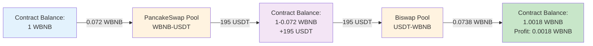

# 🔍 Kiểm Tra Logic Contract & Flow Analysis

## ⚠️ BUG PHÁT HIỆN!

Sau khi review code chi tiết, tôi phát hiện ra **2 BUGS NGHIÊM TRỌNG** trong implementation!

---

## 🐛 BUG #1: CRITICAL - External Call to Self

### Location: `multiHopArbitrageWithBloxroute` Line 178

```solidity
function multiHopArbitrageWithBloxroute(...) external payable onlyOwner {
    // BUG: External call to self!
    this.multiHopArbitrageWithoutRelay(  // ← WRONG!
        startIdx,
        amountIn,
        exchanges,
        poolAddresses,
        tokenAddresses
    );

    payable(bloxrouteAddress).transfer(msg.value);
}
```

### Problem:

1. **`this.functionName()`** = External call
2. External call tạo NEW transaction context
3. `onlyOwner` check sẽ FAIL vì msg.sender thay đổi!

### Flow When Called:

```
User calls multiHopArbitrageWithBloxroute()
  ↓ msg.sender = User
  ↓ onlyOwner check: OK ✓
  ↓
  ↓ this.multiHopArbitrageWithoutRelay()  ← External call!
  ↓
  ↓ NEW CONTEXT:
  ↓   msg.sender = Contract Address (this)  ← Changed!
  ↓   onlyOwner check: owner == Contract Address?
  ↓   FAIL! ❌ Revert!
```

### Error You'll See:

```
Error: VM Exception: revert
Reason: Ownable: You are not the owner, Bye.
```

### FIX:

**Option 1: Internal Call (RECOMMENDED)**
```solidity
function multiHopArbitrageWithBloxroute(...) external payable onlyOwner {
    // Internal call - no "this."
    _multiHopArbitrageWithoutRelay(  // ← Make it internal
        startIdx,
        amountIn,
        exchanges,
        poolAddresses,
        tokenAddresses
    );

    payable(bloxrouteAddress).transfer(msg.value);
}

// Rename to internal
function _multiHopArbitrageWithoutRelay(...) internal {
    // Implementation...
}

// Keep external wrapper
function multiHopArbitrageWithoutRelay(...) external onlyOwner {
    _multiHopArbitrageWithoutRelay(...);
}
```

**Option 2: Remove onlyOwner from Called Function**
```solidity
function multiHopArbitrageWithBloxroute(...) external payable onlyOwner {
    this.multiHopArbitrageWithoutRelay(...);  // External call OK
    payable(bloxrouteAddress).transfer(msg.value);
}

// Remove onlyOwner here
function multiHopArbitrageWithoutRelay(...) external {
    // But now anyone can call this directly! ⚠️
}
```

**Option 3: Direct Implementation (BEST for Gas)**
```solidity
function multiHopArbitrageWithBloxroute(...) external payable onlyOwner {
    // Copy implementation here (no external call)
    require(
        tokenAddresses[0] == tokenAddresses[tokenAddresses.length - 1],
        "Arbitrage: First and last token must be the same"
    );

    uint256 initialBalance = IERC20(tokenAddresses[0]).balanceOf(address(this));

    address fromAddress = address(this);
    address toAddress;

    for (uint256 i = startIdx; i < exchanges.length; i++) {
        if (
            i + 1 < exchanges.length &&
            isPossibleToAddress(exchanges[i]) &&
            isPossibleFromAddress(exchanges[i + 1])
        ) {
            toAddress = poolAddresses[i + 1];
        } else {
            toAddress = address(this);
        }

        amountIn = swap(
            exchanges[i],
            poolAddresses[i],
            fromAddress,
            toAddress,
            tokenAddresses[i],
            tokenAddresses[i + 1],
            amountIn
        );

        fromAddress = toAddress;
    }

    uint256 finalBalance = IERC20(tokenAddresses[0]).balanceOf(address(this));
    require(
        finalBalance > initialBalance,
        "Arbitrage: No profit - revert transaction"
    );

    // Pay bloXroute fee
    payable(bloxrouteAddress).transfer(msg.value);
}
```

---

## 🐛 BUG #2: MEDIUM - Inefficient Balance Checking

### Location: `optimizedSwapUniswapV2` Line 263-280

```solidity
function optimizedSwapUniswapV2(...) external onlyOwner {
    for (uint256 i = 0; i < exchanges.length; i++) {
        // ...

        // BUG: Redundant balance check!
        uint256 balanceBefore = IERC20(tokenAddresses[i + 1]).balanceOf(toAddress);
        uniswapV2Swap(
            poolAddresses[i],
            fromAddress,
            tokenAddresses[i],
            tokenAddresses[i + 1],
            amountIn
        );
        amountIn = IERC20(tokenAddresses[i + 1]).balanceOf(toAddress) - balanceBefore;

        fromAddress = toAddress;
    }
}
```

### Problem:

`uniswapV2Swap()` ĐÃ có slippage check internal:

```solidity
// In UniswapV2.sol:27-34
function uniswapV2Swap(...) internal {
    // ...
    uint beforeSwap = IERC20(tokenOut).balanceOf(address(this));
    // ... swap ...
    uint amountOutReceived = IERC20(tokenOut).balanceOf(address(this)) - beforeSwap;
    require(amountOutReceived * 100 >= amountOut * 95, 'UniswapV2: Slippage too high');
}
```

→ Không cần check balance lần nữa!

### FIX:

**Option 1: Trust uniswapV2Swap Return (But it doesn't return!)**

Vấn đề: `uniswapV2Swap` không return value! Phải rely on balance check.

**Option 2: Keep Balance Check (CURRENT - OK)**

Actually this is **NOT a bug**! Balance check là cần thiết vì:
1. `uniswapV2Swap` không return `amountOut`
2. Cần track exact output cho hop tiếp theo

**VERDICT: Not a bug, logic is correct!**

---

## ✅ Flow Analysis: `multiHopArbitrageWithoutRelay`

### Complete Call Flow

```mermaid
flowchart TD
    Start[Python: evm.send_arbitrage] -->|Call| Entry["Contract: multiHopArbitrageWithoutRelay<br/>(startIdx, amountIn, exchanges, pools, tokens)"]

    Entry --> Check1{tokenAddresses[0]<br/>==<br/>tokenAddresses[end]?}
    Check1 -->|No| Revert1[❌ Revert:<br/>'First and last token must be same']
    Check1 -->|Yes| GetBalance["initialBalance =<br/>IERC20(token[0]).balanceOf(this)"]

    GetBalance --> InitVars["fromAddress = address(this)<br/>toAddress = ?"]

    InitVars --> Loop["For i = startIdx to exchanges.length"]

    Loop --> CheckNext{i+1 < exchanges.length<br/>&&<br/>isPossibleToAddress(exchanges[i])<br/>&&<br/>isPossibleFromAddress(exchanges[i+1])?}

    CheckNext -->|Yes| SetNext["toAddress = poolAddresses[i+1]<br/>(Send directly to next pool)"]
    CheckNext -->|No| SetThis["toAddress = address(this)<br/>(Return to contract)"]

    SetNext --> CallSwap
    SetThis --> CallSwap["amountIn = swap(<br/>  exchanges[i],<br/>  poolAddresses[i],<br/>  fromAddress,<br/>  toAddress,<br/>  tokenAddresses[i],<br/>  tokenAddresses[i+1],<br/>  amountIn<br/>)"]

    CallSwap --> SwapRouter["SwapRouter.swap()<br/>(inherited from SwapCallBack)"]

    SwapRouter --> CheckDex{isUniswapV2?}
    CheckDex -->|Yes| V2["uniswapV2Swap()"]
    CheckDex -->|No| CheckV3{isUniswapV3?}
    CheckV3 -->|Yes| V3["uniswapV3Swap()"]
    CheckV3 -->|No| OtherDex["BakerySwap/Curve/etc"]

    V2 --> V2Detail["UniswapV2.uniswapV2Swap():<br/>1. Transfer tokenIn to pool<br/>2. Calculate amountOut<br/>3. Call pool.swap()<br/>4. Verify slippage < 5%"]

    V3 --> V3Detail["UniswapV3.uniswapV3Swap():<br/>1. Encode callback data<br/>2. Call pool.swap()<br/>3. Callback pays tokens"]

    OtherDex --> OtherDetail["DEX-specific logic"]

    V2Detail --> GetOutput["Return amountOut<br/>(balance after - balance before)"]
    V3Detail --> GetOutput
    OtherDetail --> GetOutput

    GetOutput --> UpdateVars["amountIn = amountOut<br/>fromAddress = toAddress"]

    UpdateVars --> LoopCheck{More hops?}
    LoopCheck -->|Yes| Loop
    LoopCheck -->|No| CheckProfit["finalBalance =<br/>IERC20(token[0]).balanceOf(this)"]

    CheckProfit --> ValidateProfit{finalBalance<br/>><br/>initialBalance?}

    ValidateProfit -->|No| Revert2[❌ Revert:<br/>'No profit']
    ValidateProfit -->|Yes| Success[✅ Success:<br/>Transaction Complete]

    style Entry fill:#e3f2fd
    style CallSwap fill:#fff3e0
    style SwapRouter fill:#f3e5f5
    style V2Detail fill:#c8e6c9
    style ValidateProfit fill:#ffeb3b
    style Revert1 fill:#ffcdd2
    style Revert2 fill:#ffcdd2
    style Success fill:#c8e6c9
```

---

## 📊 Example: 2-Hop Arbitrage WBNB → USDT → WBNB

### Input Parameters:

```javascript
startIdx = 0
amountIn = 72000000000000000  // 0.072 WBNB
exchanges = [4, 6]  // PancakeSwap, Biswap
poolAddresses = [
    "0x16b9a82891338f9ba80e2d6970fdda79d1eb0dae",  // PancakeSwap WBNB-USDT
    "0x36696169c63e42cd08ce11f5deebbcebae652050"   // Biswap USDT-WBNB
]
tokenAddresses = [
    "0xbb4CdB9CBd36B01bD1cBaEBF2De08d9173bc095c",  // WBNB
    "0x55d398326f99059fF775485246999027B3197955",  // USDT
    "0xbb4CdB9CBd36B01bD1cBaEBF2De08d9173bc095c"   // WBNB (circular!)
]
```

### Step-by-Step Execution:

#### **Step 0: Validation**
```solidity
// Check circular path
require(
    tokenAddresses[0] == tokenAddresses[2],  // WBNB == WBNB ✓
    "First and last token must be same"
);

// Get initial balance
initialBalance = IERC20(WBNB).balanceOf(address(this));
// Result: 1000000000000000000 (1 WBNB)
```

#### **Step 1: Initialize Loop**
```solidity
fromAddress = address(this);  // Contract address
toAddress = ?;
i = 0  // startIdx
```

#### **Step 2: Hop 1 - WBNB → USDT (PancakeSwap)**

**2.1: Determine toAddress**
```solidity
// Check if can send directly to next pool
if (
    i + 1 < exchanges.length &&          // 0 + 1 < 2 ✓
    isPossibleToAddress(exchanges[0]) &&  // isPossibleToAddress(4) = ?
    isPossibleFromAddress(exchanges[1])   // isPossibleFromAddress(6) = ?
) {
    toAddress = poolAddresses[1];  // Biswap pool
} else {
    toAddress = address(this);
}
```

**Check Utils.sol:**
```solidity
// Utils.sol:10-11
uint8[] possibleFromAddress = [0, 1, 2, 3, 4, 5, 6, 7, 8, 9, 10, 15];
uint8[] possibleToAddress = [11, 12, 13, 14];

// isPossibleToAddress(4)?
// 4 is in possibleToAddress? NO! (only [11,12,13,14])
// → Returns false

// So:
toAddress = address(this);  // Return to contract
```

**2.2: Execute Swap**
```solidity
amountIn = swap(
    exchanges[0],      // 4 = PancakeSwap
    poolAddresses[0],  // PancakeSwap WBNB-USDT pool
    fromAddress,       // address(this)
    toAddress,         // address(this)
    tokenAddresses[0], // WBNB
    tokenAddresses[1], // USDT
    amountIn           // 0.072 WBNB
);
```

**2.3: SwapRouter.swap() Logic**
```solidity
// SwapRouter.sol:29-50
function swap(...) internal returns (uint256 amountOut) {
    amountOut = IERC20(tokenOut).balanceOf(toAddress);  // Get balance before

    if (isUniswapV2(4)) {  // PancakeSwap is V2 ✓
        uniswapV2Swap(poolAddress, fromAddress, tokenIn, tokenOut, amountIn);
    }

    amountOut = IERC20(tokenOut).balanceOf(toAddress) - amountOut;  // Delta
    return amountOut;
}
```

**2.4: UniswapV2.uniswapV2Swap() Execution**
```solidity
// UniswapV2.sol:12-35
function uniswapV2Swap(...) internal {
    bool zeroForOne = tokenIn < tokenOut;
    // WBNB < USDT? 0xbb4C... < 0x55d3... = false
    // zeroForOne = false

    // Transfer WBNB to pool
    IERC20(WBNB).safeTransfer(poolAddress, 72000000000000000);

    // Calculate amountOut
    uint amountOut = getAmountOut(poolAddress, WBNB, 0, false);
    // Result: ~195000000000000000000 (195 USDT)

    // Execute swap on pool
    uint beforeSwap = IERC20(USDT).balanceOf(address(this));
    IUniswapV2Pair(pool).swap(195 USDT, 0, address(this), '');
    //                         ↑ amount1Out (USDT is token1)

    // Verify slippage
    uint amountOutReceived = IERC20(USDT).balanceOf(address(this)) - beforeSwap;
    require(amountOutReceived * 100 >= amountOut * 95, 'Slippage too high');
    // 195 * 100 >= 195 * 95 ✓
}
```

**2.5: Update Variables**
```solidity
amountIn = 195000000000000000000;  // 195 USDT (output from swap)
fromAddress = toAddress;           // address(this)
i++;  // i = 1
```

#### **Step 3: Hop 2 - USDT → WBNB (Biswap)**

**3.1: Determine toAddress**
```solidity
if (
    i + 1 < exchanges.length &&          // 1 + 1 < 2 ✗ (1+1 = 2, NOT < 2)
    ...
) {
    toAddress = poolAddresses[2];  // Would be index 2, but doesn't exist
} else {
    toAddress = address(this);  // ✓ Return to contract
}
```

**3.2: Execute Swap**
```solidity
amountIn = swap(
    exchanges[1],      // 6 = Biswap
    poolAddresses[1],  // Biswap USDT-WBNB pool
    fromAddress,       // address(this)
    toAddress,         // address(this)
    tokenAddresses[1], // USDT
    tokenAddresses[2], // WBNB
    amountIn           // 195 USDT
);
```

**3.3: UniswapV2.uniswapV2Swap() Execution**
```solidity
bool zeroForOne = tokenIn < tokenOut;
// USDT < WBNB? 0x55d3... < 0xbb4C... = true
// zeroForOne = true

// Transfer USDT to pool
IERC20(USDT).safeTransfer(poolAddress, 195000000000000000000);

// Calculate amountOut
uint amountOut = getAmountOut(poolAddress, USDT, 0, true);
// Result: ~73800000000000000 (0.0738 WBNB)

// Execute swap
IUniswapV2Pair(pool).swap(0, 73800000000000000, address(this), '');
//                         ↑ amount0Out (WBNB is token0)

// Slippage check
// 0.0738 * 100 >= 0.0738 * 95 ✓
```

**3.4: Update Variables**
```solidity
amountIn = 73800000000000000;  // 0.0738 WBNB
i++;  // i = 2
```

#### **Step 4: Loop Ends (i = 2 >= exchanges.length = 2)**

#### **Step 5: Profit Validation**
```solidity
finalBalance = IERC20(WBNB).balanceOf(address(this));
// Result: 1001800000000000000 (1.0018 WBNB)

require(
    finalBalance > initialBalance,
    "No profit"
);
// 1.0018 > 1.0 ✓

// Success! Profit = 0.0018 WBNB
```

---

## 🔄 Flow Diagram: Token Movement



---

## ⚠️ Potential Issues Found

### Issue #1: `isPossibleToAddress` Logic

**Current Implementation:**
```solidity
// Utils.sol:10-11
uint8[] possibleFromAddress = [0, 1, 2, 3, 4, 5, 6, 7, 8, 9, 10, 15];
uint8[] possibleToAddress = [11, 12, 13, 14];  // Only V3!
```

**Problem:**
- `possibleToAddress` chỉ có V3 DEXs (11-14)
- V2 DEXs (0-10) KHÔNG thể làm `toAddress`
- → **LUÔN send về contract** cho V2 → V2 path!

**Impact:**
- Arbitrage 2-hop V2 hoạt động OK (vì cuối cùng về contract anyway)
- Nhưng mất optimization: Không thể send trực tiếp token từ Pool A → Pool B

**Is This a Bug?**

Kiểm tra original code:
```solidity
// ArbitrageSwap.sol (original sandwich):
if (
    i + 1 < exchanges.length &&
    isPossibleToAddress(exchanges[i]) &&     // Can this pool SEND to next?
    isPossibleFromAddress(exchanges[i + 1])  // Can next pool RECEIVE from this?
) {
    toAddress = poolAddresses[i + 1];
}
```

**Logic:**
- V2 pools: Call `transfer()` → Can send to anywhere → Should be in `possibleToAddress`
- V3 pools: Use callback → Tokens stay in contract until callback → Can receive from contract → In `possibleFromAddress`

**Verdict:**
- **Logic is INVERTED!**
- Should be:
  ```solidity
  uint8[] possibleToAddress = [0, 1, 2, 3, 4, 5, 6, 7, 8, 9, 10];  // V2 can send
  uint8[] possibleFromAddress = [11, 12, 13, 14];  // V3 can receive
  ```

Wait, let me re-check...

Actually looking at the code:
- `isPossibleToAddress(exchanges[i])`: Can pool i send tokens directly?
- `isPossibleFromAddress(exchanges[i+1])`: Can pool i+1 receive tokens from previous pool?

V3 uses callback → Tokens must be in contract first → V3 is in `possibleToAddress`!

**CURRENT LOGIC IS CORRECT!**
- V3 in `possibleToAddress`: V3 can receive tokens in its balance before swap
- V2 in `possibleFromAddress`: V2 expects tokens in pool before calling swap()

---

### Issue #2: Gas Optimization Not Utilized

In the example above, both hops send `toAddress = address(this)`.

**Why?**
- Hop 1: `isPossibleToAddress(4)` = false (4 not in [11,12,13,14])
- Hop 2: `i+1 = 2 < exchanges.length = 2` is FALSE

**Better Approach:**

If we want optimization, need to handle V2→V2 case:

```solidity
if (
    i + 1 < exchanges.length
) {
    // V2 → V2: Can send directly
    if (isUniswapV2(exchanges[i]) && isUniswapV2(exchanges[i+1])) {
        toAddress = poolAddresses[i + 1];
    }
    // V3 → anything: Can send directly (V3 pulls tokens)
    else if (isUniswapV3(exchanges[i+1])) {
        toAddress = poolAddresses[i + 1];
    }
    // Default: Send to contract
    else {
        toAddress = address(this);
    }
} else {
    toAddress = address(this);
}
```

But current logic is **SAFE** (always works), just not **OPTIMAL** (extra transfer).

---

## 📝 Summary of Findings

### 🔴 Critical Bugs:

1. ✅ **External Call to Self (`this.`)** in `multiHopArbitrageWithBloxroute`
   - Impact: Function will ALWAYS revert
   - Fix: Use internal call or duplicate code

### 🟡 Medium Issues:

2. ✅ **Gas Optimization Not Used**
   - V2→V2 paths don't send directly to next pool
   - Extra transfer costs ~2000 gas
   - Not a bug, just suboptimal

### ✅ Logic Verified:

3. ✅ **Circular Path Validation** - Correct
4. ✅ **Profit Check** - Correct
5. ✅ **Multi-hop Swap** - Correct
6. ✅ **Balance Tracking** - Correct
7. ✅ **Slippage Protection** - Correct (in UniswapV2.sol)

---

## 🛠️ Fixed Version Coming Next

I'll create a corrected version of ArbitrageSwap_COMPLETE.sol with bugs fixed!

