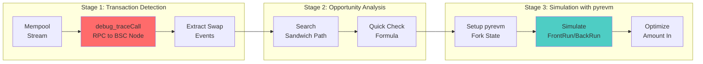
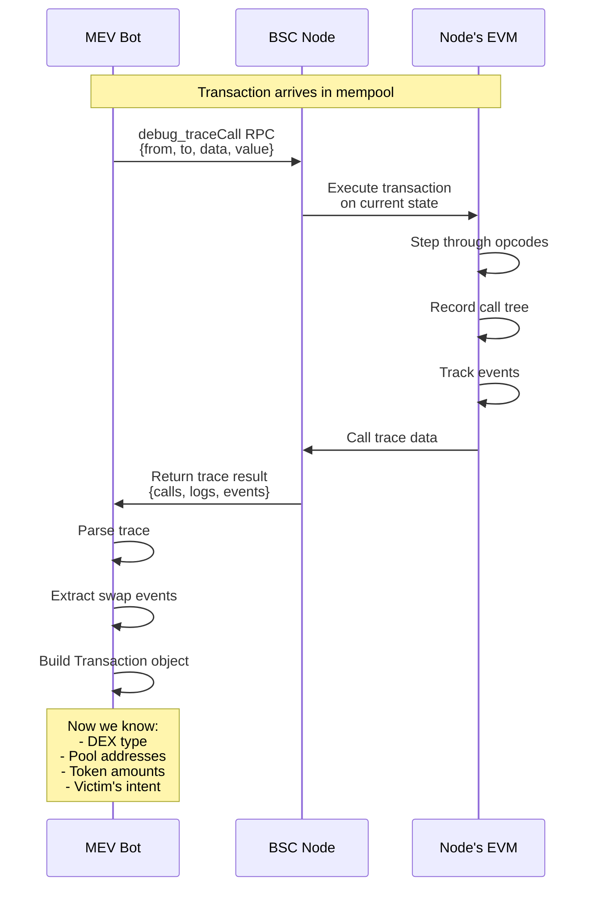
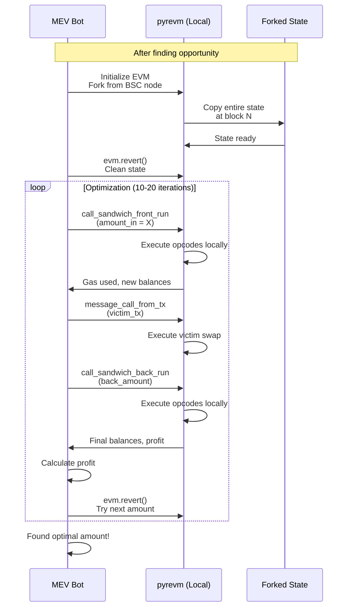
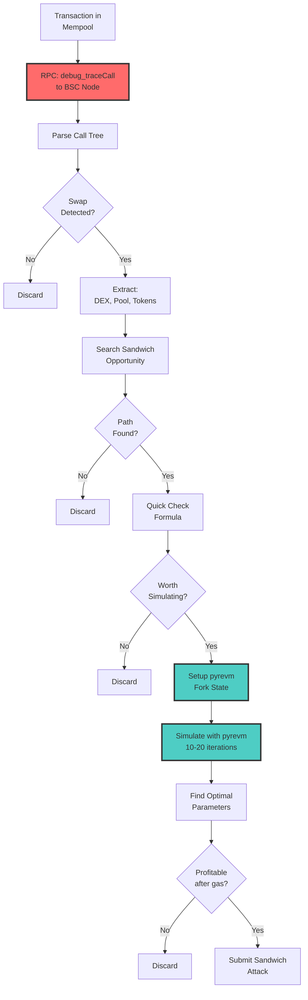

# debug_traceCall vs pyrevm - Sự Khác Biệt

## ❌ Câu Hỏi: `debug_traceCall` có dùng pyrevm không?

**TL;DR: KHÔNG!** Đây là hai công cụ hoàn toàn khác nhau, phục vụ hai mục đích khác nhau.

## 🔍 So Sánh Chi Tiết

### debug_traceCall

```
┌─────────────────────────────────────────────────────────┐
│              debug_traceCall (RPC Method)               │
├─────────────────────────────────────────────────────────┤
│  Tool:      Geth/BSC Node built-in                      │
│  Type:      RPC API call                                │
│  Purpose:   Trace PENDING transactions                  │
│  When:      BEFORE opportunity analysis                 │
│  Function:  Analyze what a transaction WOULD DO         │
│  Output:    Call tree, function calls, events           │
│  Cost:      RPC call latency (~40ms)                    │
│  State:     Uses REAL blockchain state                  │
└─────────────────────────────────────────────────────────┘
```

### pyrevm

```
┌─────────────────────────────────────────────────────────┐
│                  pyrevm (EVM Simulator)                 │
├─────────────────────────────────────────────────────────┤
│  Tool:      Rust EVM implementation                     │
│  Type:      Local Python library                        │
│  Purpose:   SIMULATE sandwich attacks                   │
│  When:      AFTER finding opportunity                   │
│  Function:  Test different attack parameters            │
│  Output:    Profit, gas, optimal amounts                │
│  Cost:      CPU computation (~10ms per sim)             │
│  State:     Forked state from blockchain                │
└─────────────────────────────────────────────────────────┘
```

## 📊 Vị Trí Trong Pipeline



## 🔄 Detailed Flow Comparison

### 1. debug_traceCall Flow



**Code Location**: `src/apis/trace_tx.py:212-278`

```python
def trace_transaction(cfg: Config, tx_detail):
    w3 = get_provider(cfg.http_endpoint)
    txContents = tx_detail["txContents"]

    tx_detail_for_trace = {
        "from": txContents["from"],
        "to": txContents["to"],
        "gas_cost": gas_price,
        "value": txContents["value"],
        "data": txContents["input"],
    }

    # ❌ NOT pyrevm - This is RPC call to BSC Node
    trace = w3.provider.make_request(
        "debug_traceCall",
        [tx_detail_for_trace, "latest", {"tracer": "callTracer"}]
    )
    # ✓ Returns call tree from BSC node's EVM
```

**What it returns**:
```json
{
  "result": [
    {
      "action": {
        "callType": "call",
        "from": "0x83806...",
        "to": "0x1c39ba...",
        "input": "0x022c0d9f...",  // swap function
        "value": "0x7a16c911b4d00000"
      },
      "calls": [
        {
          "action": {
            "callType": "call",
            "from": "0x1c39ba...",
            "to": "0x2bd232...",  // pool
            "input": "0xa9059cbb..."  // transfer
          }
        }
      ]
    }
  ]
}
```

### 2. pyrevm Flow



**Code Location**: `src/evm.py` + `src/sandwich/simulation.py:88-174`

```python
# ✓ This is pyrevm - Local Rust EVM
from pyrevm.pyrevm import EVM as _EVM

class EVM:
    def _reset(self):
        # Fork state from BSC node
        self._evm = _EVM(
            fork_url=self.http_endpoint,  # RPC to get state
            fork_block=block_hex_number,
            tracing=False,
        )

    def call_sandwich_front_run(self, amount_in, exchanges, pools, tokens):
        # ✓ Execute locally in pyrevm
        result = self.call_function(
            caller=self.account_address,
            to=self.contract_address,
            function_name="sandwichFrontRun",
            input=[amount_in, exchanges, pools, tokens],
        )
        return result
```

## 🎯 Key Differences Table

| Feature | debug_traceCall | pyrevm |
|---------|----------------|--------|
| **What** | RPC method | Local EVM simulator |
| **Where** | BSC Node (remote) | Python process (local) |
| **When** | Analyze pending tx | Simulate sandwich attack |
| **Input** | Transaction data | Contract calls + state |
| **Output** | Call tree, events | Profit, gas, balances |
| **Cost** | Network latency | CPU computation |
| **Speed** | ~40ms | ~10ms per iteration |
| **State** | Current blockchain | Forked + modifiable |
| **Modify** | ❌ Read-only | ✓ Can modify & revert |
| **Purpose** | Understand tx | Optimize attack |

## 📝 Use Cases

### debug_traceCall Use Cases

1. **Detect Swap Events**
   ```python
   # What DEX is being used?
   if input.startswith("0x022c0d9f"):
       dex = "UNISWAP_V2"
   elif input.startswith("0x128acb08"):
       dex = "UNISWAP_V3"
   ```

2. **Extract Token Transfers**
   ```python
   # Which tokens are being swapped?
   if input.startswith("0xa9059cbb"):  # transfer
       recipient = "0x" + input[2+32:2+32+40]
       value = hex_to_uint256(input[2+32+40:2+32+40+64])
   ```

3. **Identify Pools**
   ```python
   # Which pool is involved?
   pool_address = call["to"]
   ```

4. **Understand Transaction Flow**
   ```
   User → Router → Pool A → Pool B → User
   ```

### pyrevm Use Cases

1. **Optimize Amount In**
   ```python
   for amount_in in [100, 105, 110, 115]:
       evm.revert()
       profit = simulate_sandwich(amount_in)
       if profit > max_profit:
           max_profit = profit
   ```

2. **Calculate Gas**
   ```python
   evm.call_sandwich_front_run(...)
   front_gas = evm.latest_gas_used  # 146,000
   ```

3. **Verify Profitability**
   ```python
   revenue = final_balance - initial_balance
   gas_cost = (front_gas + back_gas) * gas_price
   net_profit = revenue - gas_cost
   ```

4. **Test Edge Cases**
   ```python
   # What if victim uses max slippage?
   # What if pool has low liquidity?
   # What if there's another frontrunner?
   ```

## 🔄 Complete Integration



## 💡 Analogy

Think of it like planning a heist:

### debug_traceCall = Security Camera Footage
```
👁️ "Let me watch the security cameras to see:
   - What route does the victim take?
   - Which doors do they open?
   - What's in their bag?
   - When do they arrive?"

→ Just OBSERVING the victim's transaction
→ Understanding WHAT they're doing
→ Finding opportunities
```

### pyrevm = Heist Simulation
```
🎮 "Now let me SIMULATE the heist:
   - If I run ahead, where should I hide?
   - How much should I steal to maximize profit?
   - What if I use route A vs route B?
   - Can I escape without getting caught?"

→ Actually TESTING the attack
→ OPTIMIZING the parameters
→ VERIFYING it will work
```

## 📊 Timing Breakdown

```
Complete Flow: 150ms total

├── debug_traceCall:        40ms  (RPC to BSC node)
│   ├── Network latency:    10ms
│   ├── Node execution:     25ms
│   └── Response parsing:   5ms
│
├── Path search:            5ms   (Python logic)
│
├── Quick check:            5ms   (Formula calculation)
│
└── pyrevm simulation:      100ms (Local Rust execution)
    ├── Setup/fork:         5ms
    ├── Iteration 1-10:     90ms  (9ms each)
    │   ├── Revert:         1ms
    │   ├── FrontRun:       3ms
    │   ├── Victim:         2ms
    │   └── BackRun:        3ms
    └── Final calc:         5ms
```

## 🎯 Summary

### debug_traceCall
- ✅ Phân tích transaction của VICTIM
- ✅ Extract swap events
- ✅ Hiểu victim muốn làm gì
- ✅ Tìm opportunities
- ❌ KHÔNG simulate attack
- ❌ KHÔNG optimize parameters

### pyrevm
- ❌ KHÔNG dùng để trace victim tx
- ❌ KHÔNG detect swap events
- ✅ Simulate ATTACKER's transactions
- ✅ Optimize amount_in
- ✅ Calculate gas
- ✅ Verify profitability

### Pipeline
```
debug_traceCall → Find Opportunity → pyrevm → Optimize Attack
    (Analyze)                         (Simulate)
```

## 🔧 Code Evidence

### debug_traceCall Code
**File**: `src/apis/trace_tx.py:223-225`

```python
# This is RPC call to BSC Node
trace = w3.provider.make_request(
    "debug_traceCall",
    [tx_detail_for_trace, "latest", {"tracer": "callTracer"}]
)
```

**Provider**: `web3.py` library
**Target**: BSC Node RPC endpoint
**Method**: Geth's debug_traceCall API

### pyrevm Code
**File**: `src/evm.py:127-143`

```python
# This is local Rust EVM
from pyrevm.pyrevm import EVM as _EVM

self._evm = _EVM(
    fork_url=self.http_endpoint,  # Only to COPY state
    fork_block=block_hex_number,
    tracing=False,
    env=Env(...)
)
```

**Library**: pyrevm (Rust binding)
**Target**: Local Python process
**Method**: Rust EVM execution

## 📚 References

- `debug_traceCall`: [Geth Documentation](https://geth.ethereum.org/docs/interacting-with-geth/rpc/ns-debug)
- `pyrevm`: [GitHub Repo](https://github.com/paradigmxyz/pyrevm)
- Usage in project: `src/apis/trace_tx.py` vs `src/evm.py`

---

**Kết luận**: `debug_traceCall` và `pyrevm` là hai công cụ khác nhau, phục vụ hai giai đoạn khác nhau trong MEV pipeline. Không nên nhầm lẫn!

*Tài liệu được tạo bởi Claude Code*
*Ngày: 2025-11-26*
