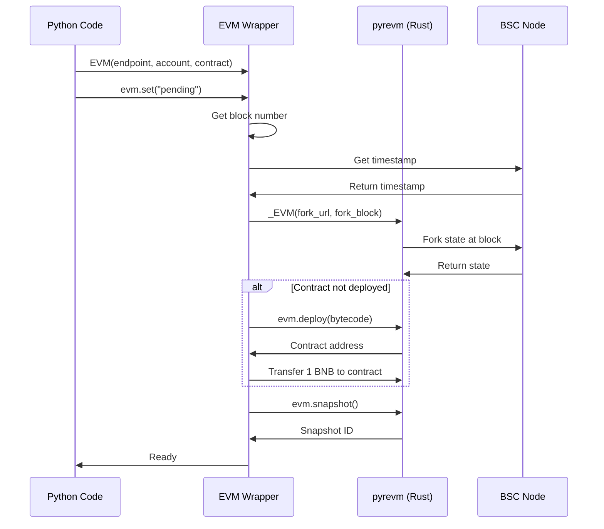
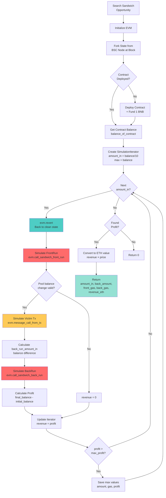
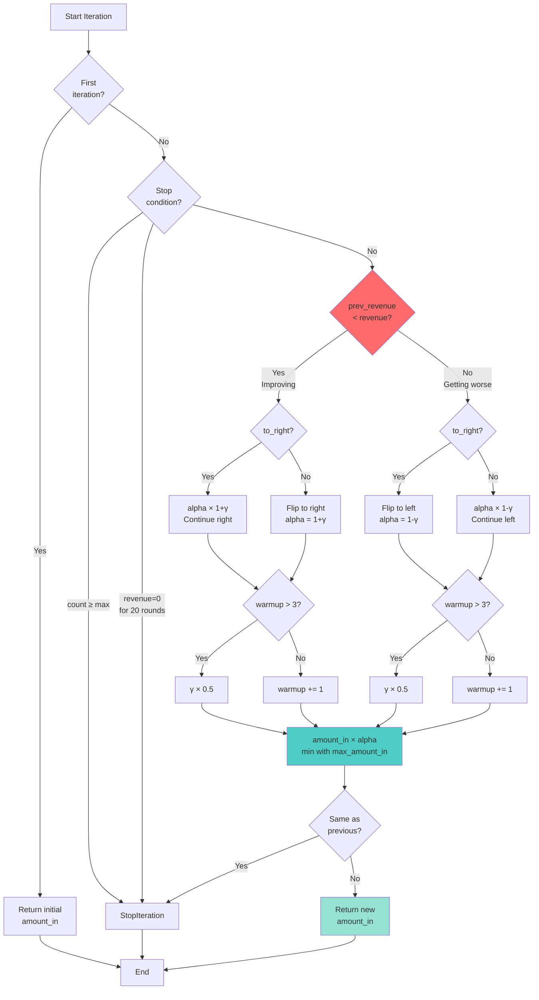

# Phân Tích Chi Tiết: pyrevm trong MEV Attack

## 📌 Tổng Quan

### pyrevm là gì?

**pyrevm** là Python bindings cho [revm](https://github.com/bluealloy/revm) - một implementation của Ethereum Virtual Machine (EVM) được viết bằng Rust.

**Ưu điểm**:
- ⚡ **Blazing Fast**: Nhanh hơn py-evm (Python EVM) rất nhiều lần nhờ được viết bằng Rust
- 🔄 **Fork Support**: Có thể fork state từ remote node
- 📸 **Snapshot/Revert**: Test nhiều scenarios mà không cần reset
- 📊 **Tracing**: Hỗ trợ trace execution
- 🎯 **Accurate**: Kết quả giống hệt mainnet

**Vị trí trong dự án**:
```
pyrevm (Rust binding)
    ↓
src/evm.py (Python wrapper)
    ↓
src/sandwich/simulation.py (Usage)
src/arbitrage/search.py (Usage)
```

## 🏗️ Kiến Trúc Wrapper Layer

### 1. Wrapper Class (`src/evm.py`)

```python
class EVM:
    def __init__(self, http_endpoint, account_address, contract_address):
        self.http_endpoint = http_endpoint      # BSC node RPC
        self.account_address = account_address  # MEV bot address
        self.__contract_address = contract_address
        self._evm = Optional[_EVM]             # pyrevm instance
```

**Responsibilities**:
- Wrap pyrevm với interface dễ sử dụng
- Quản lý state (snapshot/revert)
- Helper functions cho contract calls
- Track gas usage

### 2. Initialization Flow



**Code Implementation** (`src/evm.py:88-156`):

```python
def set(self, fork_block_number: str):
    # Xác định block number và timestamp
    self.fork_block_number = fork_block_number
    if fork_block_number in ["latest", "pending"]:
        self.block_timestamp = int(time.time())
    else:
        self.block_timestamp = get_timestamp(self.http_endpoint, fork_block_number) + 3

    # Reset EVM với state từ node
    self._reset()

    # Tạo snapshot ban đầu
    self.snapshot = self._evm.snapshot()
    self.commit_count = 0

def _reset(self):
    # Fork từ BSC node
    self._evm = _EVM(
        fork_url=self.http_endpoint,
        fork_block=block_hex_number,
        tracing=False,
        env=Env(
            block=BlockEnv(
                number=int(block_hex_number, 16),
                timestamp=self.block_timestamp,
                prevrandao=bytes([0] * 32)
            ),
        ),
    )

    # Deploy contract nếu chưa có
    if self.__contract_address is None:
        bytecode = open("contract/bytecode/contracts/BSC.sol/BSC.bin").read()
        self.__contract_address_for_test = self._evm.deploy(
            deployer=self.account_address,
            code=bytes.fromhex(bytecode)
        )
        # Fund contract với 1 BNB
        self.put_balance(1 * 10**18)
```

## 🔄 Snapshot/Revert Mechanism

### Concept

```
State 0 (Fork)
    ↓
[Snapshot A]
    ↓
FrontRun Tx → State 1
    ↓
Victim Tx → State 2
    ↓
BackRun Tx → State 3
    ↓
Check Profit → Not good
    ↓
[Revert to Snapshot A] → Back to State 0
    ↓
Try different amount_in
    ↓
FrontRun Tx → State 1'
...
```

### Implementation

```python
class EVM:
    def revert(self):
        """Revert về snapshot gần nhất"""
        if self.commit_count > 0:
            try:
                self._evm.revert(self.snapshot)
            except OverflowError:
                pass
            self.snapshot = self._evm.snapshot()
            self.commit_count = 0

    @update_commit_count_decorator
    def call_sandwich_front_run(self, amount_in, exchanges, pools, tokens):
        """Mỗi call làm tăng commit_count"""
        result = self.call_function(...)
        # commit_count += 1 (via decorator)
        return result
```

**Decorator** (`src/evm.py:49-55`):
```python
def update_commit_count_decorator(func):
    def wrapper(self, *args, **kwargs):
        result = func(self, *args, **kwargs)
        self.commit_count += 1  # Track số lần modify state
        return result
    return wrapper
```

## 🎯 Sandwich Simulation Workflow

### Complete Flow



### Code Walkthrough (`src/sandwich/simulation.py:88-174`)

#### Bước 1: Khởi tạo

```python
def simulate_sandwich(cfg: Config, evm: EVM, victim_tx: Transaction,
                     path: Path, amount_in, maximum_rates):
    # Revert về clean state
    evm.revert()

    # Lấy balance hiện tại của contract
    balance_of_contract = evm.balance_of_contract(path.token_addresses[0])

    # Tạo iterator để optimize amount_in
    simulation_iterator = SimulationIterator(
        amount_in=amount_in if amount_in > 0 else balance_of_contract,
        max_amount_in=balance_of_contract
    )
```

#### Bước 2: Iterative Simulation

```python
    for i, amount_in in enumerate(simulation_iterator):
        evm.revert()  # Revert về snapshot mỗi lần thử

        try:
            # 2.1: Record trạng thái TRƯỚC front run
            back_run_before_amount = evm.balance_of(
                evm.contract_address,
                path.token_addresses[-1]
            )

            before_balance_of_pool = []
            for idx, pool_address in enumerate(path.pool_addresses):
                before_balance_of_pool.append(
                    evm.balance_of(pool_address, path.token_addresses[idx + 1])
                )

            # 2.2: Simulate FRONT RUN
            evm.call_sandwich_front_run(
                amount_in, path.exchanges,
                path.pool_addresses, path.token_addresses
            )
            front_run_gas_used = evm.latest_gas_used

            # 2.3: Validate pool balance change (không tăng quá maximum_rate)
            for idx, pool_address in enumerate(path.pool_addresses):
                after_balance_of_pool = evm.balance_of(
                    pool_address,
                    path.token_addresses[idx + 1]
                )
                if after_balance_of_pool / before_balance_of_pool[idx] < maximum_rates[idx]:
                    raise Exception("Invalid rate")

            # 2.4: Simulate VICTIM TRANSACTION
            evm.message_call_from_tx(victim_tx)

            # 2.5: Calculate amount cho BACK RUN
            if eq_address(path.token_addresses[0], path.token_addresses[-1]):
                # Same token (1-hop)
                back_run_amount_in = (
                    evm.balance_of(evm.contract_address, path.token_addresses[-1])
                    + amount_in
                ) - back_run_before_amount
            else:
                # Different token (2-hop)
                back_run_amount_in = (
                    evm.balance_of(evm.contract_address, path.token_addresses[-1])
                    - back_run_before_amount
                )

            # 2.6: Simulate BACK RUN
            evm.call_sandwich_back_run(
                back_run_amount_in, path.exchanges,
                path.pool_addresses, path.token_addresses
            )
            back_run_gas_used = evm.latest_gas_used

            # 2.7: Calculate PROFIT
            revenue = evm.balance_of_contract(path.token_addresses[0]) - balance_of_contract

        except Exception as e:
            # Nếu simulation fail, set revenue = 0
            back_run_amount_in = 0
            revenue = 0

        # 2.8: Update iterator với revenue
        simulation_iterator.revenue = revenue

        # 2.9: Lưu lại nếu profit cao hơn
        if revenue > maximized_revenue:
            maximized_amount_in = amount_in
            maximized_back_run_amount_in = back_run_amount_in
            maximized_revenue = revenue
            maximized_front_run_gas_used = front_run_gas_used
            maximized_back_run_gas_used = back_run_gas_used
            simulation_iterator.maximized_revenue = revenue
```

#### Bước 3: Return Results

```python
    if maximized_revenue == 0:
        return 0, 0, 0, 0, 0

    # Convert revenue sang ETH value
    token_price_based_on_eth = get_token_price(
        cfg, cfg.wrapped_native_token_address, path.token_addresses[0]
    )
    revenue_based_on_eth = maximized_revenue * token_price_based_on_eth

    return (
        maximized_amount_in,
        maximized_back_run_amount_in,
        maximized_front_run_gas_used,
        maximized_back_run_gas_used,
        revenue_based_on_eth
    )
```

## 🧮 SimulationIterator - Optimization Algorithm

### Algorithm: Adaptive Step Size

```python
class SimulationIterator:
    def __init__(self, amount_in, max_amount_in,
                 break_count_if_zero=20, max_count=100,
                 to_right=True, alpha=1, warmup=0, gamma=0.05):
        self.amount_in = amount_in          # Initial guess
        self.max_amount_in = max_amount_in  # Upper bound
        self.alpha = alpha                  # Step multiplier
        self.gamma = gamma                  # Learning rate
        self.to_right = to_right           # Search direction
```

### Logic Flow



### Example Simulation

```
Iteration 1: amount_in = 100 BNB  → revenue = 1.0 BNB ✓
Iteration 2: amount_in = 105 BNB  → revenue = 1.2 BNB ✓ (improving, continue right)
Iteration 3: amount_in = 111 BNB  → revenue = 1.5 BNB ✓ (improving, continue right)
Iteration 4: amount_in = 118 BNB  → revenue = 1.6 BNB ✓ (improving, continue right)
Iteration 5: amount_in = 125 BNB  → revenue = 1.55 BNB ✗ (worse, flip to left)
Iteration 6: amount_in = 119 BNB  → revenue = 1.62 BNB ✓ (improving, continue left)
Iteration 7: amount_in = 113 BNB  → revenue = 1.58 BNB ✗ (worse, flip to right)
Iteration 8: amount_in = 119 BNB  → revenue = 1.62 BNB (same, STOP)

Optimal: amount_in = 119 BNB, revenue = 1.62 BNB
```

## 🔧 Helper Functions

### 1. Balance Queries

```python
def balance(self, address: str) -> int:
    """Native token (BNB) balance"""
    return self._evm.get_balance(address)

def balance_of(self, address: str, token: str) -> int:
    """ERC20 token balance"""
    result = self.call_function(
        caller="0xd8dA6BF26964aF9D7eEd9e03E53415D37aA96045",  # vitalik.eth
        to=token,
        value=0,
        function_name="balanceOf",
        input=[address],
        abi=token_abi,
        is_static=True,  # Read-only call
    )
    return result[0]

def balance_of_contract(self, token: str) -> int:
    """Contract's token balance"""
    return self.balance_of(self.contract_address, token)
```

### 2. Function Call Wrapper

```python
def call_function(self, caller, to, value, function_name, input, abi, is_static=False):
    # Encode function call
    calldata = self.encode_function_input_data(function_name, input, abi)

    # Call EVM
    bytes_result = self._evm.message_call(
        caller=caller,
        to=to,
        value=value,
        calldata=calldata,
        is_static=is_static,
    )

    # Decode result
    result = self.encode_function_output_data(function_name, bytes_result, abi)
    return result
```

### 3. Sandwich Specific Calls

```python
@update_commit_count_decorator
def call_sandwich_front_run(self, amount_in, exchanges, pool_addresses, token_addresses):
    """Simulate sandwich front run transaction"""
    function_name = "sandwichFrontRun"
    result = self.call_function(
        caller=self.account_address,
        to=self.contract_address,
        value=0,
        function_name=function_name,
        input=[amount_in, exchanges, pool_addresses, token_addresses],
        abi=contract_abi,
    )
    return result

@update_commit_count_decorator
def call_sandwich_back_run(self, amount_in, exchanges, pool_addresses, token_addresses):
    """Simulate sandwich back run transaction"""
    function_name = "sandwichBackRun"
    result = self.call_function(
        caller=self.account_address,
        to=self.contract_address,
        value=0,
        function_name=function_name,
        input=[amount_in, exchanges, pool_addresses, token_addresses],
        abi=contract_abi,
    )
    return result

@update_commit_count_decorator
def message_call_from_tx(self, tx: Transaction):
    """Simulate victim transaction"""
    result = self._evm.message_call(
        caller=tx.caller,
        to=tx.receiver,
        gas=tx.gas,
        gas_price=tx.gas_price,
        value=tx.value if isinstance(tx.value, int) else int(tx.value, 16),
        calldata=bytes.fromhex(tx.data[2:]) if isinstance(tx.data, str) else tx.data,
    )
    return result
```

## 📊 Gas Tracking

```python
@property
def latest_gas_used(self):
    """Get gas used by last transaction"""
    return self._evm.result.gas_used
```

**Usage trong simulation**:
```python
evm.call_sandwich_front_run(...)
front_run_gas_used = evm.latest_gas_used  # Get gas immediately after

evm.message_call_from_tx(victim_tx)
# Victim gas không quan trọng

evm.call_sandwich_back_run(...)
back_run_gas_used = evm.latest_gas_used

# Tính tổng gas cost
total_gas = front_run_gas_used + back_run_gas_used
total_cost = total_gas * gas_price
```

## 🔬 Uniswap V2 Quick Path

Để tối ưu performance, dự án có **quick path** cho Uniswap V2 không cần EVM simulation.

### Decision Flow

```python
# Trong src/sandwich/search.py
if is_only_uniswap_v2_path(path):
    # Quick calculation bằng formula
    amount_in, expected_revenue = calculate_uniswap_v2_sandwich(
        cfg, reserve_by_pools, swap_event, path, 0.01, block_number
    )
    if expected_revenue < 1e9 * 100000 * 2:  # Min threshold
        continue
else:
    # Dùng EVM simulation cho UniswapV3, Curve, etc.
    amount_in = 0

# Sau đó vẫn dùng EVM để verify & get exact gas
(front_run_amount_in, back_run_amount_in, front_run_gas_used,
 back_run_gas_used, revenue_based_on_eth) = simulate_sandwich(
    cfg, evm, victim_tx, path, amount_in, maximum_rates
)
```

### Formula-based Calculation (`src/sandwich/simulation.py:177-227`)

```python
def calculate_uniswap_v2_sandwich(cfg, reserve_by_address, swap_event, path, slippage=0.01):
    # Lấy reserves
    reserve_in, reserve_out = sort_reserve(token0, token1, reserve0, reserve1)

    victim_amount_in = swap_event.amount_in
    victim_amount_out = swap_event.amount_out
    victim_minimum_amount_out = math.floor(victim_amount_out * (1 - slippage))

    # Giải phương trình bậc 2 để tìm optimal amount_in
    a = 997000 * victim_minimum_amount_out
    b = (1997000 * reserve_in + 997000 * victim_amount_in) * victim_minimum_amount_out
    c = (1000000 * reserve_in^2 * victim_minimum_amount_out +
         997000 * reserve_in * victim_amount_in * victim_minimum_amount_out -
         997000 * reserve_in * reserve_out * victim_amount_in)

    amount_in = (-b + math.sqrt(b^2 - 4*a*c)) / (2*a)

    # Simulate qua 3 swaps
    amount_out = get_uniswa_v2_amount_out(amount_in, reserve_in, reserve_out)
    reserve_in += amount_in
    reserve_out -= amount_out

    victim_amount_out = get_uniswa_v2_amount_out(victim_amount_in, reserve_in, reserve_out)
    reserve_in += victim_amount_in
    reserve_out -= victim_amount_out

    final_amount_out = get_uniswa_v2_amount_out(amount_out, reserve_out, reserve_in)

    return math.floor(amount_in), math.floor(max(final_amount_out - amount_in, 0))
```

**Lợi ích**:
- ⚡ Nhanh hơn ~10-50ms so với EVM simulation
- 🎯 Chính xác (dùng công thức toán học)
- 💰 Vẫn dùng EVM sau để verify & lấy gas

## 📈 Performance Comparison

### Timing Breakdown

```
Method 1: EVM Simulation Only (UniswapV3, Curve)
├── Setup EVM:              ~5ms
├── Iteration 1:            ~10ms
│   ├── Revert:             ~1ms
│   ├── FrontRun:           ~3ms
│   ├── Victim:             ~2ms
│   ├── BackRun:            ~3ms
│   └── Balance queries:    ~1ms
├── Iteration 2-10:         ~90ms
└── Total:                  ~100ms

Method 2: Formula + EVM (UniswapV2)
├── Formula calculation:    ~1ms
├── Setup EVM:              ~5ms
├── Single iteration:       ~10ms
│   ├── Revert:             ~1ms
│   ├── FrontRun:           ~3ms
│   ├── Victim:             ~2ms
│   ├── BackRun:            ~3ms
│   └── Balance queries:    ~1ms
└── Total:                  ~16ms

Savings: ~84ms (84% faster!)
```

## 🆚 So Sánh với Alternatives

### 1. py-evm (Python EVM)

| Feature | pyrevm | py-evm |
|---------|--------|--------|
| Language | Rust (binding) | Pure Python |
| Speed | ⚡⚡⚡⚡⚡ | ⚡ |
| Fork Support | ✅ Easy | ⚠️ Complex |
| Snapshot/Revert | ✅ Native | ❌ Manual |
| Maintenance | ✅ Active | ⚠️ Slower |
| **Verdict** | **Winner** | Legacy |

### 2. Tenderly Fork API

| Feature | pyrevm (Local) | Tenderly API |
|---------|----------------|--------------|
| Latency | ~10ms | ~200ms (network) |
| Cost | Free (compute) | $$ (API calls) |
| Privacy | ✅ Private | ⚠️ Shared |
| Limits | None | Rate limits |
| Offline | ✅ Yes | ❌ No |
| **Verdict** | **Winner for MEV** | Good for testing |

### 3. Hardhat Fork

| Feature | pyrevm | Hardhat |
|---------|--------|---------|
| Language | Python/Rust | JavaScript |
| Speed | ⚡⚡⚡⚡⚡ | ⚡⚡⚡ |
| Integration | Python MEV bot | JS Testing |
| Snapshot | Native | ✅ Yes |
| **Verdict** | **Python projects** | **JS projects** |

## 🎯 Use Cases trong Dự Án

### 1. Sandwich Attack Simulation

**File**: `src/sandwich/simulation.py:88-174`

```python
# Tìm optimal amount_in để maximize profit
(amount_in, back_amount, front_gas, back_gas, revenue) = simulate_sandwich(
    cfg, evm, victim_tx, path, initial_amount, max_rates
)
```

### 2. Arbitrage Simulation

**File**: `src/arbitrage/search.py`

```python
# Simulate multi-hop arbitrage
evm.send_arbitrage(amount_in, exchanges, pools, tokens)
profit = evm.balance_of_contract(native_token) - initial_balance
```

### 3. Contract Testing

**File**: `contract/test/*.ts` (qua Python wrapper)

```python
# Test sandwich functions
evm.call_sandwich_front_run(amount, exchanges, pools, tokens)
evm.message_call_from_tx(victim_tx)
evm.call_sandwich_back_run(amount, exchanges, pools, tokens)

# Verify balances
assert evm.balance_of_contract(token) > initial_balance
```

### 4. Gas Estimation

```python
# Ước tính chính xác gas cho production
evm.call_sandwich_front_run(...)
front_run_gas = evm.latest_gas_used  # Actual gas used

# So sánh với hardcoded estimates
assert front_run_gas < 150000  # Should be under 150k gas
```

## ⚠️ Gotchas & Best Practices

### 1. Memory Management

**Problem**: EVM state tăng dần sau mỗi simulation

**Solution**:
```python
# BAD: Không revert
for amount in amounts:
    evm.call_sandwich_front_run(amount, ...)
    # State keeps growing

# GOOD: Revert sau mỗi iteration
for amount in amounts:
    evm.revert()  # Back to clean state
    evm.call_sandwich_front_run(amount, ...)
```

### 2. Commit Count Tracking

**Problem**: Quên track commits → revert không chạy

**Solution**:
```python
# Dùng decorator để auto-track
@update_commit_count_decorator
def call_sandwich_front_run(self, ...):
    # Auto increment commit_count
    ...

# Revert chỉ chạy nếu có commits
def revert(self):
    if self.commit_count > 0:
        self._evm.revert(self.snapshot)
        self.commit_count = 0
```

### 3. Static vs Non-static Calls

**Problem**: Modify state bằng static call

**Solution**:
```python
# BAD: Static call không thể modify state
evm.call_function(..., is_static=True)
evm.balance_of(...)  # State unchanged!

# GOOD: Non-static cho state changes
evm.call_sandwich_front_run(...)  # is_static=False (default)
```

### 4. Block Timestamp

**Problem**: Timestamp không đúng → MEV timing sai

**Solution**:
```python
# Set timestamp = current + 3s (next block)
self.block_timestamp = get_timestamp(http_endpoint, fork_block) + 3

# Trong BSC: 3s block time
# Trong Ethereum: 12s block time
```

### 5. Gas Limit

**Problem**: Transaction revert vì out of gas

**Solution**:
```python
# pyrevm mặc định không limit gas cho simulation
# Nhưng khi submit real tx, phải set gas limit hợp lý

front_run_gas_used = evm.latest_gas_used
safe_gas_limit = front_run_gas_used * 1.2  # +20% buffer
```

## 📚 Code Examples

### Example 1: Simple Balance Check

```python
from src.evm import EVM

# Setup
evm = EVM(
    http_endpoint="http://localhost:8545",
    account_address="0xYourAddress",
    contract_address="0xContractAddress"
)
evm.set("pending")

# Check balance
wbnb = "0xbb4CdB9CBd36B01bD1cBaEBF2De08d9173bc095c"
balance = evm.balance_of_contract(wbnb)
print(f"Contract has {balance / 1e18} WBNB")
```

### Example 2: Simulate Swap

```python
# Simulate a swap
result = evm.call_function(
    caller=evm.account_address,
    to=evm.contract_address,
    value=0,
    function_name="sandwichFrontRun",
    input=[
        1000000000000000000,  # 1 WBNB
        [0],  # UniswapV2
        ["0xPoolAddress"],
        ["0xWBNB", "0xToken"]
    ],
    abi=contract_abi
)
gas_used = evm.latest_gas_used
print(f"Swap used {gas_used} gas")
```

### Example 3: Optimization Loop

```python
# Find optimal amount
evm.revert()
initial_balance = evm.balance_of_contract(wbnb)

best_amount = 0
best_profit = 0

for amount in range(1, 100):
    evm.revert()

    # Front run
    evm.call_sandwich_front_run(amount * 1e18, exchanges, pools, tokens)

    # Victim
    evm.message_call_from_tx(victim_tx)

    # Back run
    evm.call_sandwich_back_run(back_amount, exchanges, pools, tokens)

    # Check profit
    final_balance = evm.balance_of_contract(wbnb)
    profit = final_balance - initial_balance

    if profit > best_profit:
        best_amount = amount
        best_profit = profit

print(f"Best: {best_amount} WBNB → {best_profit / 1e18} WBNB profit")
```

## 🔍 Debugging Tips

### 1. Enable Tracing

```python
# Trong src/evm.py:_reset()
self._evm = _EVM(
    fork_url=self.http_endpoint,
    fork_block=block_hex_number,
    tracing=True,  # Enable tracing
    ...
)

# Print logs
evm.print_logs()
```

### 2. Check Revert Reasons

```python
try:
    evm.call_sandwich_front_run(...)
except Exception as e:
    print(f"Revert reason: {e}")
    # Có thể là: insufficient balance, slippage too high, etc.
```

### 3. Compare with Mainnet

```python
# Simulate với block cũ
evm.set("0x12345")  # Known block

# So sánh kết quả với transaction thật
real_tx_hash = "0xabc..."
# Check if simulation matches real tx
```

## 🚀 Performance Tuning

### 1. Reduce Iterations

```python
# Default: max 100 iterations
simulation_iterator = SimulationIterator(
    amount_in=initial,
    max_amount_in=max_amount,
    max_count=50,  # Reduce from 100 to 50
    break_count_if_zero=10  # Stop earlier if no profit
)
```

### 2. Batch Operations

```python
# BAD: Multiple small queries
for pool in pools:
    balance = evm.balance_of(pool, token)  # Slow!

# GOOD: Multicall (if supported)
balances = multicall.get_balances(pools, token)
```

### 3. Cache Common Values

```python
# Cache contract balance
class EVM:
    def __init__(self, ...):
        self._balance_cache = {}

    def balance_of_contract(self, token):
        if token not in self._balance_cache:
            self._balance_cache[token] = self.balance_of(
                self.contract_address, token
            )
        return self._balance_cache[token]
```

## 📖 Tài Liệu Liên Quan

- [revm GitHub](https://github.com/bluealloy/revm) - Rust EVM implementation
- [pyrevm GitHub](https://github.com/paradigmxyz/pyrevm) - Python bindings
- [PyO3 Documentation](https://pyo3.rs/) - Rust-Python FFI
- [EVM Opcodes](https://www.evm.codes/) - Understanding EVM

---

*Tài liệu được tạo bởi Claude Code*
*Ngày: 2025-11-26*
*Phân tích chi tiết về pyrevm usage trong MEV Attack project*
