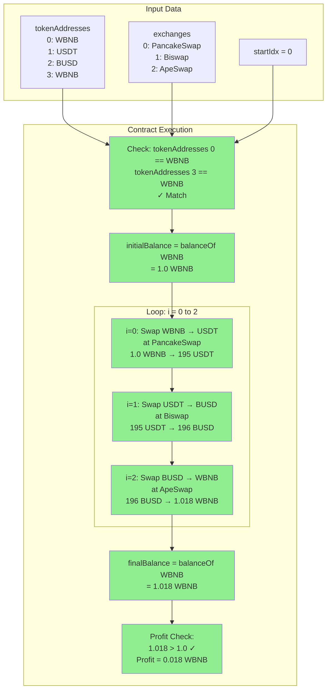
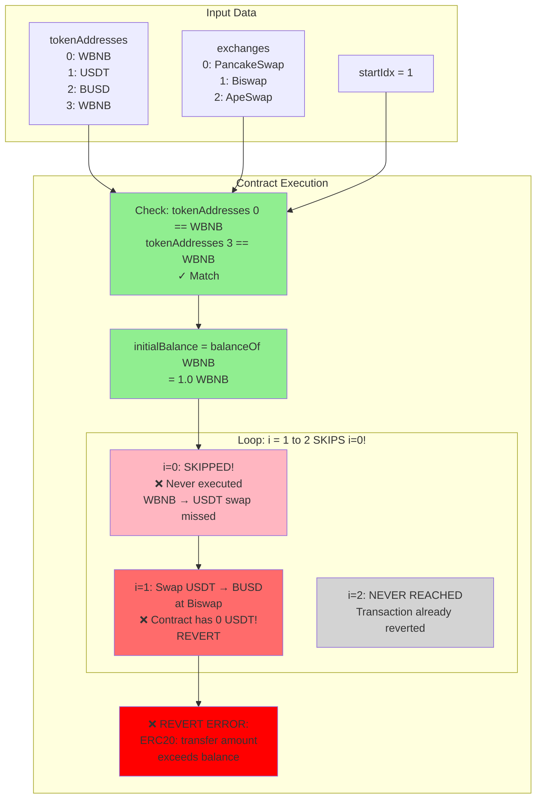

# Visual Diagram: startIdx Bug

## Flow Comparison: startIdx = 0 vs startIdx = 1

### ✅ CORRECT: startIdx = 0



---

### ❌ WRONG: startIdx = 1



---

## Token Balance Tracking

### Scenario: startIdx = 0 (CORRECT)

| Step | Action | Contract Balance |
|------|--------|-----------------|
| 0 | Initial State | 1.0 WBNB, 0 USDT, 0 BUSD |
| 1 | i=0: WBNB → USDT at PancakeSwap | 0 WBNB, **195 USDT**, 0 BUSD |
| 2 | i=1: USDT → BUSD at Biswap | 0 WBNB, 0 USDT, **196 BUSD** |
| 3 | i=2: BUSD → WBNB at ApeSwap | **1.018 WBNB**, 0 USDT, 0 BUSD |
| 4 | Profit Check | ✅ 1.018 > 1.0 → **Profit!** |

---

### Scenario: startIdx = 1 (WRONG)

| Step | Action | Contract Balance | Result |
|------|--------|-----------------|--------|
| 0 | Initial State | 1.0 WBNB, 0 USDT, 0 BUSD | |
| 1 | i=0: SKIPPED! | 1.0 WBNB, **0 USDT**, 0 BUSD | ❌ No USDT! |
| 2 | i=1: Try USDT → BUSD | 1.0 WBNB, 0 USDT, 0 BUSD | ❌ **REVERT!** |
| 3 | Error | - | **Transfer amount exceeds balance** |

---

## Code Logic Flow

```solidity
function _executeArbitrage(
    uint8 startIdx,           // ← Problem parameter
    uint256 amountIn,
    uint8[] memory exchanges,
    address[] memory poolAddresses,
    address[] memory tokenAddresses
) internal {
    // ✅ Check: First token == Last token
    require(
        tokenAddresses[0] == tokenAddresses[tokenAddresses.length - 1],
        //                ↑                                          ↑
        //              Index 0                                   Index 3
        "Arbitrage: First and last token must be the same"
    );

    // ✅ Measure balance of token at index 0
    uint256 initialBalance = IERC20(tokenAddresses[0]).balanceOf(address(this));
    //                                              ↑
    //                                          Index 0 (WBNB)

    address fromAddress = address(this);
    address toAddress;

    // ❌ BUG: Loop starts from startIdx, not 0!
    for (uint256 i = startIdx; i < exchanges.length; i++) {
        //              ↑
        //          If startIdx = 1, we skip i=0!

        if (
            i + 1 < exchanges.length &&
            isPossibleToAddress(exchanges[i]) &&
            isPossibleFromAddress(exchanges[i + 1])
        ) {
            toAddress = poolAddresses[i + 1];
        } else {
            toAddress = address(this);
        }

        // ❌ BUG: If i starts at 1, we try to swap tokenAddresses[1]
        //         But we never got tokenAddresses[1] because we skipped i=0!
        amountIn = swap(
            exchanges[i],
            poolAddresses[i],
            fromAddress,
            toAddress,
            tokenAddresses[i],      // ← If i=1, this is USDT (but we have 0 USDT!)
            tokenAddresses[i + 1],
            amountIn
        );

        fromAddress = toAddress;
    }

    // ✅ Measure balance of token at index 0 again
    uint256 finalBalance = IERC20(tokenAddresses[0]).balanceOf(address(this));

    // ✅ Check profit
    require(
        finalBalance > initialBalance,
        "Arbitrage: No profit - revert transaction"
    );
}
```

---

## Logic Conflict Visualization

```
┌─────────────────────────────────────────────────────────────────┐
│                     CONTRACT LOGIC CONFLICT                      │
└─────────────────────────────────────────────────────────────────┘

┌──────────────────────┐
│  Balance Checks      │
│  (Always use index 0)│
└──────────────────────┘
         │
         ├─→ initialBalance = tokenAddresses[0]  (WBNB)
         │
         └─→ finalBalance = tokenAddresses[0]    (WBNB)


         BUT...

┌──────────────────────┐
│  Swap Loop           │
│  (Uses startIdx)     │
└──────────────────────┘
         │
         ├─→ for (i = startIdx; ...)
         │
         └─→ swap tokenAddresses[i] → tokenAddresses[i+1]
                                 ↑
                        If startIdx = 1, starts at USDT
                        but we only have WBNB!


CONFLICT:
─────────
We measure WBNB balance (index 0)
But we start swapping from USDT (index 1)

This is like:
1. Putting 1 BTC in your wallet
2. Trying to spend 1 ETH (which you don't have)
3. Getting "insufficient balance" error
```

---

## Fix Comparison

### BEFORE (with startIdx)

```solidity
function multiHopArbitrageWithoutRelay(
    uint8 startIdx,          // ❌ Useless parameter
    uint256 amountIn,
    uint8[] memory exchanges,
    address[] memory poolAddresses,
    address[] memory tokenAddresses
) external onlyOwner {
    _executeArbitrage(startIdx, amountIn, exchanges, poolAddresses, tokenAddresses);
}

function _executeArbitrage(
    uint8 startIdx,          // ❌ Useless parameter
    uint256 amountIn,
    uint8[] memory exchanges,
    address[] memory poolAddresses,
    address[] memory tokenAddresses
) internal {
    // ...
    for (uint256 i = startIdx; i < exchanges.length; i++) {
        //              ↑
        //          Always 0 anyway!
    }
}
```

**Python call:**
```python
input=[0, amount_in, exchanges, pool_addresses, token_addresses]
#      ↑
#   Always 0!
```

---

### AFTER (without startIdx)

```solidity
function multiHopArbitrageWithoutRelay(
    uint256 amountIn,        // ✅ No startIdx
    uint8[] memory exchanges,
    address[] memory poolAddresses,
    address[] memory tokenAddresses
) external onlyOwner {
    _executeArbitrage(amountIn, exchanges, poolAddresses, tokenAddresses);
}

function _executeArbitrage(
    uint256 amountIn,        // ✅ No startIdx
    uint8[] memory exchanges,
    address[] memory poolAddresses,
    address[] memory tokenAddresses
) internal {
    // ...
    for (uint256 i = 0; i < exchanges.length; i++) {
        //              ↑
        //          Hardcoded 0 (correct for arbitrage!)
    }
}
```

**Python call:**
```python
input=[amount_in, exchanges, pool_addresses, token_addresses]
#   ↑
# No 0!
```

**Benefits:**
- ✅ Clearer code
- ✅ Less parameters = less gas
- ✅ No confusion
- ✅ Impossible to set wrong startIdx

---

## Summary

| Aspect | With startIdx | Without startIdx |
|--------|--------------|------------------|
| **Code clarity** | ❌ Confusing | ✅ Clear |
| **Gas cost** | ❌ +200 gas | ✅ -200 gas |
| **Potential bugs** | ❌ Can set wrong value | ✅ No risk |
| **Function signature** | ❌ 5 parameters | ✅ 4 parameters |
| **Python code** | ❌ Must pass 0 | ✅ No extra parameter |
| **Contract ABI size** | ❌ Larger | ✅ Smaller |
| **Deployment cost** | ❌ Higher | ✅ Lower |

**Recommendation:** 🔨 **Remove startIdx parameter completely**
