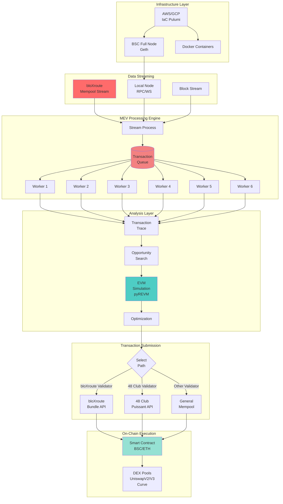
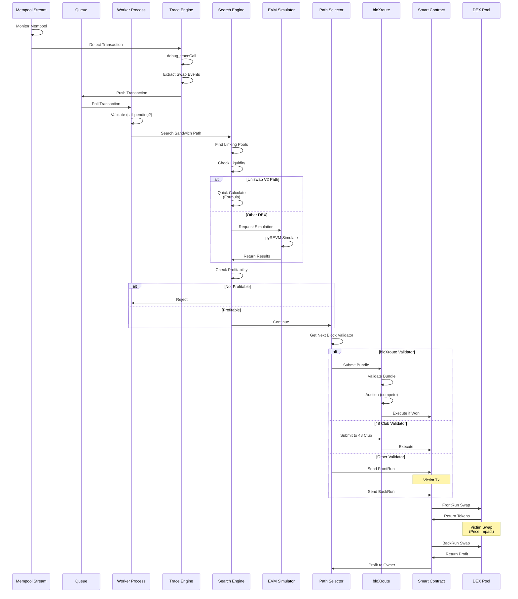
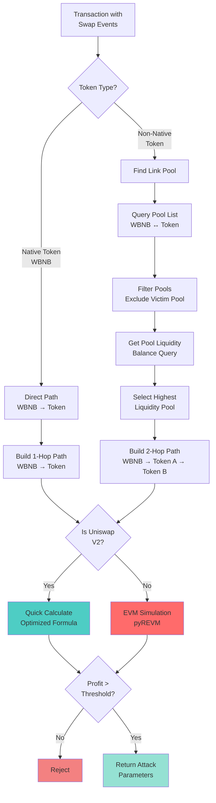
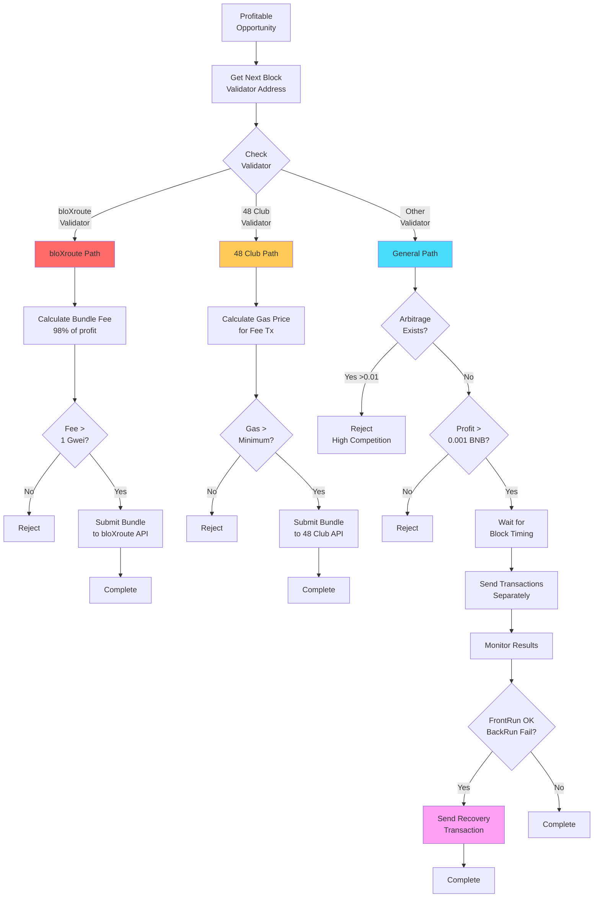
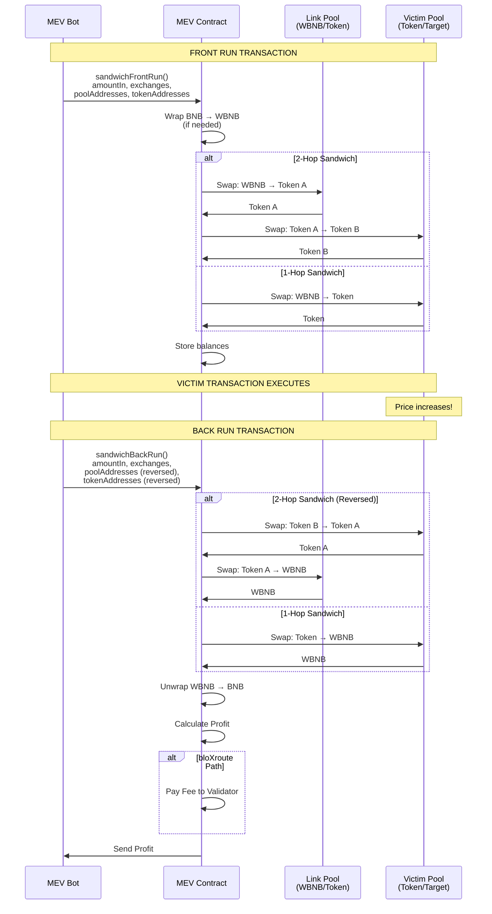
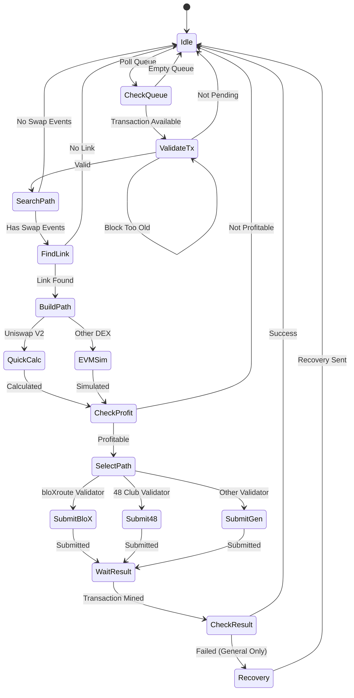
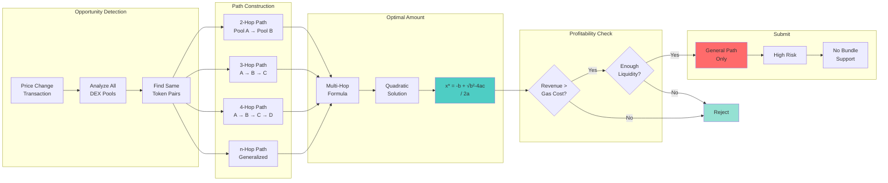
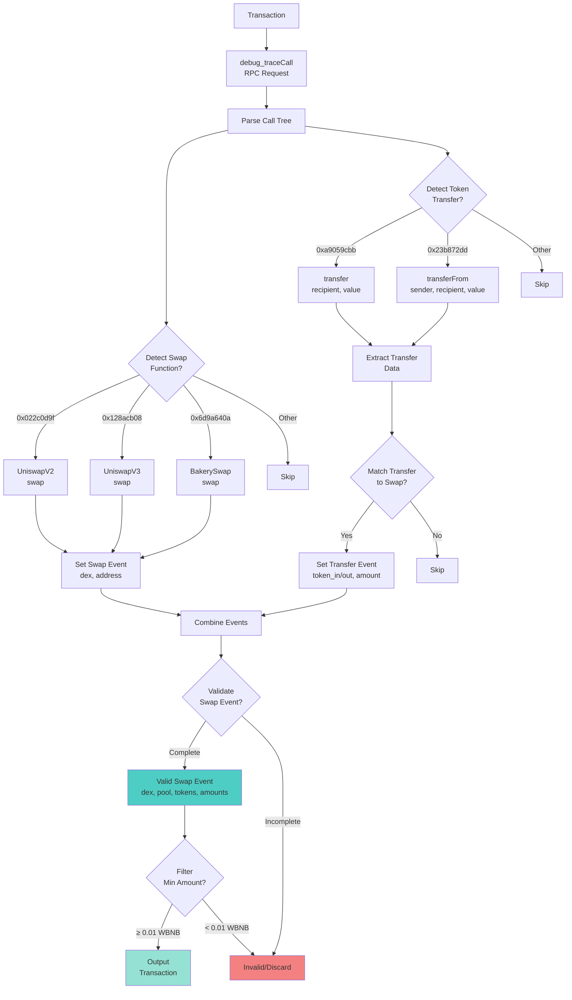
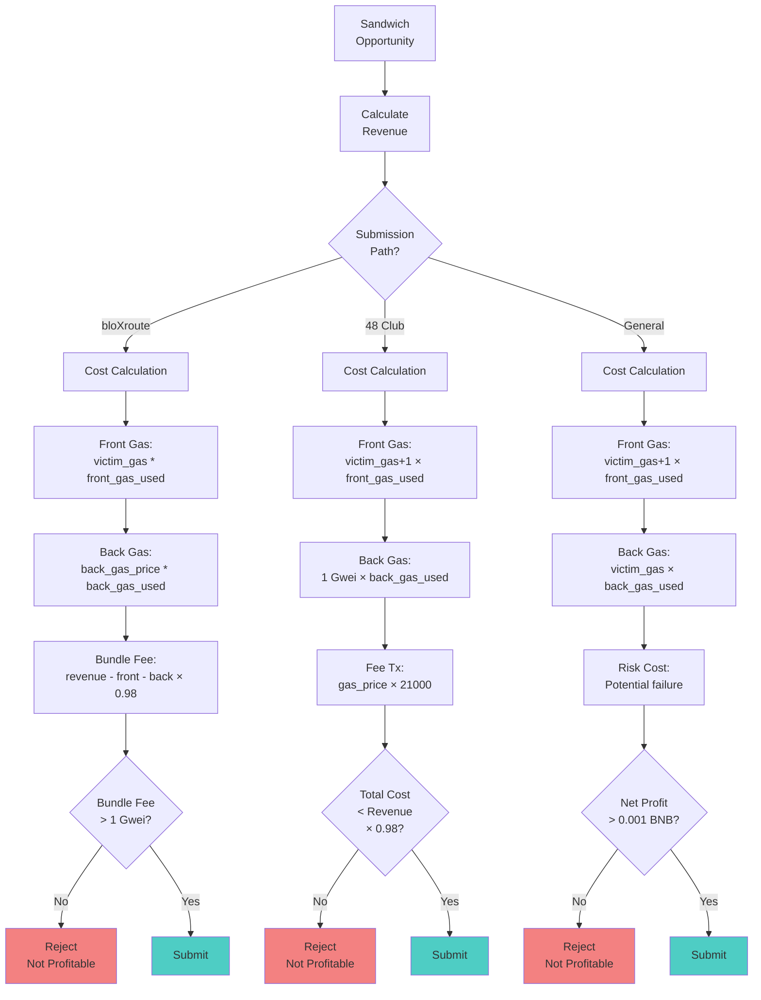

# MEV Attack Workflow - Mermaid Diagrams

Tài liệu này cung cấp các sơ đồ workflow dưới dạng Mermaid để dễ dàng visualize và nhúng vào các công cụ hỗ trợ.

## 1. Kiến Trúc Tổng Thể



## 2. Sandwich Attack - Complete Flow



## 3. Mempool Processing Pipeline

```mermaid
flowchart LR
    subgraph Input["Input Sources"]
        BX[bloXroute<br/>~200ms faster]
        LN[Local Node<br/>Standard]
    end

    subgraph Filter["Filtering Stage"]
        F1{Has Gas<br/>Info?}
        F2{Has Data<br/>(contract)?}
    end

    subgraph Trace["Trace Stage"]
        T1[debug_traceCall]
        T2[Parse Call Tree]
        T3{Found Swap<br/>Function?}
    end

    subgraph Extract["Extract Stage"]
        E1[Detect Function<br/>Selectors]
        E2[Extract Transfers]
        E3[Build SwapEvents]
        E4{Valid<br/>Swaps?}
    end

    subgraph Output["Output"]
        Q[(Queue)]
        D[Discard]
    end

    BX --> F1
    LN --> F1

    F1 -->|No| D
    F1 -->|Yes| F2
    F2 -->|No| D
    F2 -->|Yes| T1

    T1 --> T2
    T2 --> T3
    T3 -->|No| D
    T3 -->|Yes| E1

    E1 --> E2
    E2 --> E3
    E3 --> E4

    E4 -->|No| D
    E4 -->|Yes| Q

    style BX fill:#ff6b6b
    style Q fill:#4ecdc4
    style D fill:#95e1d3
```

## 4. Sandwich Path Discovery



## 5. Path Selection Logic



## 6. Smart Contract Execution Flow



## 7. Worker Process State Machine



## 8. Multi-Hop Arbitrage Path



## 9. Transaction Trace Analysis



## 10. Cost-Benefit Analysis Flow



## Cách Sử Dụng Diagrams

### Trong GitHub
Các diagram Mermaid sẽ tự động render khi xem file `.md` trên GitHub.

### Trong VSCode
Cài đặt extension "Markdown Preview Mermaid Support" để preview.

### Trong Documentation Sites
Các công cụ như GitBook, MkDocs, Docusaurus đều hỗ trợ Mermaid.

### Export to Image
Sử dụng Mermaid Live Editor (https://mermaid.live) để export sang PNG/SVG.

---

*Tài liệu được tạo tự động bởi Claude Code*
*Ngày: 2025-11-26*
